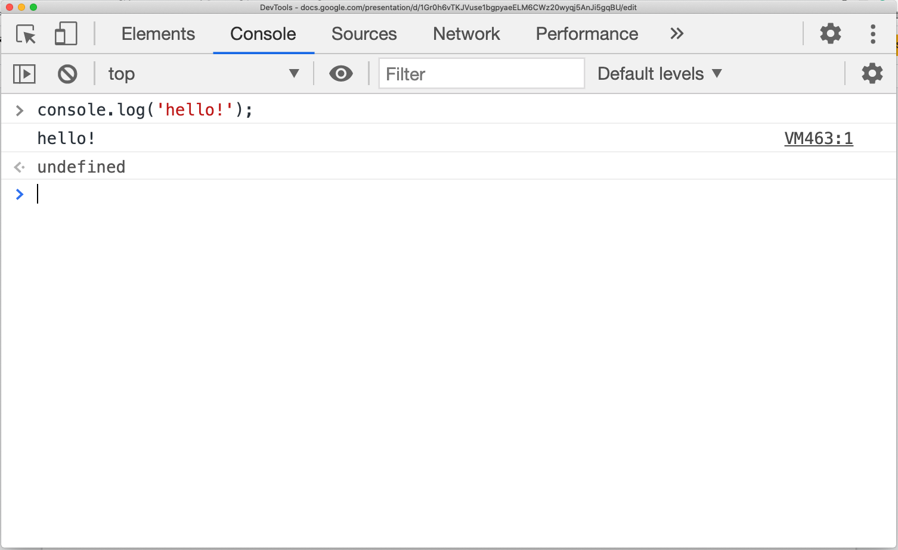
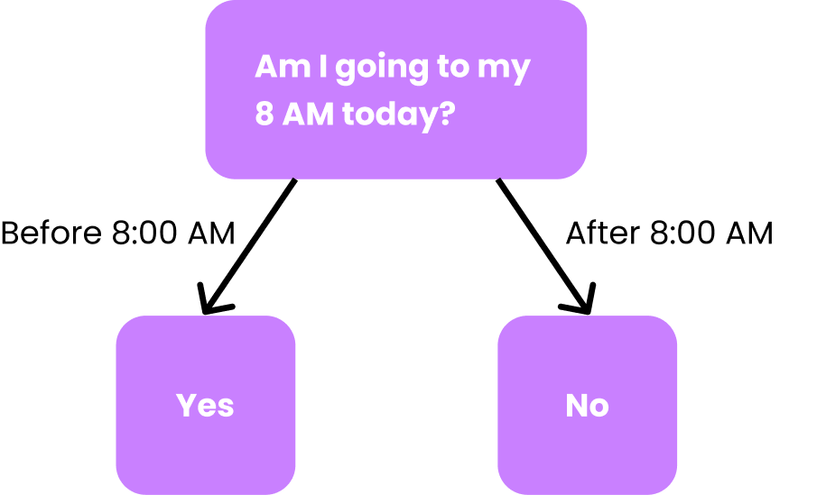

# Hacksprint Session 1: Intro to React Native + JavaScript

**Date**: January 14, 2021

**Location**: Zoom

**Teachers**: Eugene Lo

## Resources

- [Slides](https://tinyurl.com/hacksprint21-s1-slides)
- [ACM Membership Attendance Portal](https://members.uclaacm.com/login)

## What we'll be learning today

- [Background](#background)
  - [Mobile Development](#mobile-development)
  - [Native Mobile Development](#native-mobile-development)
  - [Cross-Platform/Hybrid Mobile Development](#cross-platform/hybrid-mobile-development)
  - [React Native](#react-native)
- [Creating Your Own React Native App](#creating-your-own-react-native-app)
  - [What is Expo?](#what-is-expo)
- [Intro to JavaScript](#intro-to-javascript)
  - [Console](#console)
  - [Comments](#comments)
  - [Types, Values, and Operators](#types-values-and-operators)
    - [Numbers](#numbers)
    - [Strings](#strings)
    - [Booleans](#booleans)
  - [Variables](#variables)
  - [Functions](#functions)
  - [Conditionals](#conditionals)
  - [Objects](#objects)
  - [Conclusion](#conclusion)

Welcome to the very first session of Hack Sprint during Winter '21! If you are here for the instructions for how to create your very own React Native app using Expo, feel free to hop straight to the [Creating Your Own React Native App](#creating-your-own-react-native-app) section.

## Background

Before jumping right into React Native, it's worth it to provide context for why something like React Native was created in the first place, and how the landscape of mobile development came to be.

### Mobile Development

**Mobile development** encompasses much more than just building phone applications (apps). Nowadays, mobile development is the development of apps for *any* mobile device - meaning a device you can carry around with ease - including phones, tablets, smart watches. As time went on, more and more interfaces for developing apps were created, and they more or less fit three main categories. Native development (development on platform-specific tools), mobile web apps (making websites responsive enough to be able to be used on phones), and cross-platform development (one codebase for multiple platforms). For the purposes of this discussion, I won't be talking about mobile web apps, because they fall under web development. If you're interested in web development, though, I know of these pretty cool people who taught an [entire workshop series](https://github.com/uclaacm/hackschool-f20) on web development last Fall (hint, it's us).

### Native Mobile Development

**Native mobile development** is development using tools specific to each platform (iOS, Android, etc.). For example, native development of iOS apps use either Objective-C and Swift (created later on) as their native programming language, and Android apps require the use of either Java or Kotlin (also added later on). **Native apps**, or apps built using native development, are installed directly onto each mobile device. The way you can tell if an app is native is if it is downloaded from the platform's propriety distribution service, or "app store". For iOS, this is the App Store, and for Android, this is Google Play.

At the beginning of mobile development, native development was the only way to create native apps for each platform. This is all fine and dandy, but this means that we have to learn *two separate languages/technologies* in order to develop both iOS and Android apps. On top of this, both of these apps have to be *written from scratch* each time. *And*, if I wanted to add my app onto the Windows phone ecosystem (I would never do this, but stick with me for demonstration purposes), I would have to learn *another* language/technology, because Windows apps are created using C/C++. All of this work I have to do to make sure everyone can use my app no matter what platform they're on is *way* over my pay grade!! Well actually, I'm not getting paid at all, but if I was, this would be above that.


What if there existed some magic translation device that was able to take code we've written only *once* and have it translate to each platform's native code automatically, without us having to do any additional work? Then, we'd only have to learn one language/technology across all platforms. Wait... across all platforms... ~~a~~cross ~~all~~ platform~~s~~... cross-platorm!

### Cross-Platform/Hybrid Mobile Development

**Cross platform development** was created later on, and it was largely motivated by the previously mentioned pain point of having to learn separate language/technologies for each platform. Using cross-platform development, we're now able to build apps across multiple platforms *using one codebase*. Usually, but not all the time, cross-platform solutions involve a *hybrid* approach, where the development process is part-mobile, part-web. There are many cross-platform tools out there, and although they are implemented in different ways, they are all solutions to the same drawbacks behind native development. [**React Native**](https://reactnative.dev/), created by Facebook, is by far the current winner in terms of popularity, but other cross-platform tools you may have heard of are [**Ionic**](https://ionicframework.com/), [**Xamarin**](https://dotnet.microsoft.com/apps/xamarin) (backed by Microsoft), and [**Flutter**](https://flutter.dev/) (backed by Google).

### React Native

Finally, we arrive at React Native - all this suspense was killing me! **React Native** is a cross-platform tool used to build *native* mobile apps JavaScript. This distinction is important - React Native is able to still make native apps because what it does behind the scenes is translate the JavaScript code into the *native* code for the platform it is running on. For iOS, this is Objective-C, and for Android, this is Java. React Native is open-source and backed by Facebook, and it has a ton of community support, meaning you'll have an easier time finding support for any issues you may be running into. For more information on React Native, feel free to checkout the official website [here](https://reactnative.dev/).

Although React Native is a novel tool that fixes some issues with pure native development, there has to be pros and cons associated with using it, or else literally every mobile developer would be using React Native or some other cross-platform tool. First and foremost, of course, React Native is "learn once, write anywhere". Due to its cross-platform nature, once you write JavaScript code for your app, it is able to be run anywhere after being translated into the relevant platform. As a result, it becomes faster to get your app off of its feet, and it's easier to build for multiple platforms. Finally, the JavaScript syntax has an (arguably) lower learning curve compared to languages like Swift and Java, so if you're starting as a complete beginner, this may be where to look.

*But*, with every yin, there must be a yang. First and foremost, React Native apps have slightly worse performance compared to native apps written in native code, because React Native first has to take some time translating all of the JavaScript code. *Generally*, this performance decrease is not visible to the user of the mobile app, because it is very slight, but nonetheless it is still there. There are some restricted user interface (UI) capabilities when using React Native. For most use cases, React Native can handle UI fine. However, if your app becomes more and more intense in the UI it uses (i.e. animatioins, background stuff running all the time), the performance difference starts to show more clearly between React Native and native development. Additionally, because React Native acts as a layer above native development, it acts as an outsider tapping into iOS and Android. Because iOS and Android are very attentive to privacy, some capabilities cannot be accessed by React Native and are proprietary functions of the platforms themselves. For example, iOS has a platform-specific techology called [ARKit](https://developer.apple.com/augmented-reality/), which is a bunch of code that utilizes iPhone's AR sensors. If you foresee yourself making an app around something like this, then native app development might be the answer for you instead. Additionally, if your app needs to use the camera, you will have to jump into writing native code to handle that, because iOS does not make that functionality available to React Native. Finally, React Native is dependent on Facebook. Although React Native is extremely popular now with amazing community support, so it's highly unlikely that Facebook will take it down out of nowhere, this risk is present nonetheless. Once React Native goes down, all projects done with React Native will no longer be supported, which is Not Very Cool™. If you're interested, this [Medium article](https://medium.com/mop-developers/mobile-app-development-react-native-vs-native-ios-android-49c5c168045b) highlights more in depth the tradeoffs between using React Native and native development.

## Creating Your Own React Native App

Now, let's talk about how you can create your very own React Native app! There are two main ways of accomplishing this. One way is by using the React Native build tools directly. This, however, has a high learning curve, because it hides nothing from people of the complexity of React Native development, and it will probably be information overload for someone just getting started. Because of this, we *strongly* recommend using Expo to work with React Native, because it only exposes to us what is immediately necessary for development, while Expo takes care of the nitty gritty for us behind the scenes.

### What is Expo?

Expo is a set of tools and services built around React Native. It is an interface that provides us with many features provided to us right out of the box. Using Expo, all we have to do to create an app is run a few commands in the terminal, and Expo takes care of installing all of the necessary code and files we need to get started.

For a comprehensive guide on how to install Expo + the necessary software, and how to create and run a React Native app afterwards, we highly recommend using the [Get Started](https://docs.expo.io/get-started/installation/) guide on the Expo website, and following at least the "Installation", "Create a new app", and "Errors and debugging" sections.

## Intro to JavaScript

Now that we know from a high level what React Native is all about, let's begin dissecting it by learning more about what makes it all tick: JavaScript! **JavaScript**, as you may already know, is a programming language used primarily in web development. Most browsers have support for running in the browser, and React, the web development tool from which React Native is built off of, is written in and JavaScript. The goal of this workshop is to give you the fundamental necessities for writing React Native apps using JavaScript.

### Console

The main way to interact with JavaScript is by using something known as the **console**. 



The **console** gives us a convenient way to run JavaScript in the browser. After entering valid JavaScript code, we can immediately see the results produced by it. We also are able to cycle through the history of lines we've entered previously using the up and down arrow keys.

Google Chrome provides the Developer Tools console (shown above), which is accessible by right clicking on any part of the page and selecting "Inspect", then going to the "Console" tag of the window that pops up. Other commly used browsers like Firefox and Safari also have their own consoles in the browser (Safari requires some extra steps to enable the console to be enabled. See [here](https://balsamiq.com/support/faqs/browserconsole/#:~:text=To%20do%20that%2C%20go%20into,shortcut%20Option%20%2B%20%E2%8C%98%20%2B%20C.) for how to open the console for each browser).

Although the Chrome DevTools console displays the result to us after each line, this is just an added feature of Chrome DevTools, even though it's not actually "printing" the value. In order to explicitly log values in JavaScript, we use `console.log()`, where the value we want to print out goes inside the parentheses.

### Comments

In JavaScript, **comments** are used purely for annotation purposes and don't actually do anything. Comments are useful if you want to describe how a piece of your code functions, or if you want to leave yourself a little "TODO" reminder to come back to later. In order to write single line comments in JavaScript, we add `//` in front of the line. In order to write mulitiline comments, we add `/*` to start the multiline comment, and `*/` to end the comment.

``` javascript
// This is a single line comment.

/* 
This is a 
multiline
comment
*/
```

### Types, Values, and Operators

In JavaScript, and kind of "information" takes the form of a **value**. There are several basic **types**: numbers, booleans, and strings.

#### Numbers

The `number` type contains, of course, all of the number values. `20` `3.33`, `-88.8`, and `6e23` are all valid `number` values in JavaScript (`6e23` represents scientific notation, so it is equivalent to 6 * 10^23).

``` javascript
20          // integers
3.33        // decimals
-88.8     // negative numbers
6.02e23     // scientific notation
```

We can perform operations between numbers using *arithmetic operators*. These operators (`+`, `- ` , `*`, `/`) do the same arithmetic as the addition, subtraction, multiplication, and division you learned in elementary school:

``` javascript
/* arithmetic */
> 10 + 20  // addition
< 30

> 10 - 20  // subtraction
< -10

> 10 * 20  // multiplication
< 200

> 10 / 20  // division
< 0.5
```

Note: the `>` and `<` indicate what you input into the console and what the console spits out, respectively. 

We can also perform comparison between numbers using *comparative operators*. These comparisons will result in either `true` or `false` (booleans) depending on whether the comparison is a true statement.

``` javascript
> 6 === 8  // equality check
< false

> 6 !== 8  // inequalty check
< true

> 6 < 8    // less than
< true

> 6 > 8    // greater than
< false

> 6 <= 8   // less than or equal to
< true

> 6 >= 8   // greater than or equal to
< false
```

Note: If you are coming from a background in another programming language, like C++, Java, or Python, you may be confused as to why we are using the triple equals `===` and `!==` instead of `==` or `!=`, as it would be in these other languages. The short answer is that `===` and `!==` are different from `==` or `!=` in JavaScript. The `===` and `!==` more like the `==` and `!=` from these other languages, and for all intents and purposes, we recommend you always use them over the  `==` and `!=` in JavaScript. If you want a deeper look into exactly what the difference is, [this page](https://developer.mozilla.org/en-US/docs/Web/JavaScript/Equality_comparisons_and_sameness) explains the distinction more clearly.

#### Strings

The `string` type in JavaScript takes any sequence of characters. The way we let JavaScript know that it is in fact a string is by enclosing our sequence of characters in either single quotes `''` or double quotes `""`. Both single quotes and double quotes mean the same thing in JavaScript (in some other programming languages, single quotes and double quotes indicate different things).

The following are all examples of strings:

``` Javascript
'Eugene'
"1"
'2 weeks of break is never long enough'
```

We can perform *string concatenation* on two separate strings to form one string using the `+` operator:

```javascript
> 'I love ' + 'React Native!!!'
< "I love React Native!!!"
```

Note here that the console in Chrome DevTools will give the string back in double quotes no matter how you formatted it.

One cool thing (or painful thing) about string concatenation is that only one of the values you are concatenating have to be an actual string. Then, everything gets treated as a string.

``` javascript
> 'My favorite number is ' + 7
< "My favorite number is 7"

> 3 + '5';
< "35"
```

Additionally, we have the same comparison operators from numbers available to us. The `===` and `!==` comparisons check if the strings are exactly the same (case-sensitive). The `<` , `>`, `<=`, and `>=` operators compare the strings in alphanumeric order.

``` javascript
> 'Eugene' === 'Eugene'
< true

> 'Eugene' === 'eugene'
< false

> 'Eugene' !== 'eugene'
> true

> 'Eugene' < 'Jody'
< true

> 'Eugene' > 'Jody'
< false
```

Again, I would like to reiterate that these comparison operators are comparing the strings *alphanumerically*. I am not inheritantly less than Jody (another Hack officer) as a human being - at least in the JavaScript context.

#### Booleans

Finally, we have the `boolean` type. This type can only take one of two possible values: `true` and `false`. If something isn't true, it's false. And if something isn't false, it's true. If only real life were that simple.

The operators we have available to perform on booleans are called *logical operators*. The AND operator (`&&`) only returns `true` if *all* values being compared equal true. The OR operator (`||`) returns `true` if at least one value is  `true`. Finally, the NOT operator `!` returns the opposite value of the boolean value it is performed on.

``` javascript
/* AND */
> true && true
< true

> true && false
< false

> false && true
< false

> false && false
< false

/* OR */
> true || true
< true

> true || false
< true

> false || true
< true

> false || false
< false

/* NOT */
> !true
< false

> !false
< true
```

Not that the values in these logical values do not have to be the literal values `true` and `false`. They can also be expressions that result in a boolean. Take, for example, the comparison operators we just talked about:

``` javascript
/* AND */
> 5 > 3 && 'apple' < 'banana'
< true

/* OR */
> 3 !== 3 || true
< true

/* NOT */
> !(3 > 4)
< true
```

Note: we need the parentheses wrapped around `3 > 4` here because we want the NOT operator to be performed on the *result* of the comparison. If we left out the parentheses, `!3 > 4`, the NOT operator would only be performed on the 3 itself.

### Variables

Having values is cool, but sometimes we want to be able to store this value in so that we can can use them over and over again, or perform some computation using them later. It would also help if we could give these values names that describe more clearly what they are.

For these use cases, we would use a **variable**! Variables give us a way to refer to a certain value using a self-defined name. In our previous example, we would declare a variable named `age` , which we would then assign to `20`.

To create and assign a variable, we use either `let` or `const`, then the name that we want to give the variable.

``` javascript
let age = 20;
const firstMonth = 'January';
```

Note: here we added semicolons `;` after each line. Semicolons are optional in JavaScript, however, so we could have left them out. For consistency, we will continue to use semicolons for the rest of this README.

One important point of distinction is that `const` variables are referred to as such because they are *constants*. This means that once they are created and assigned, you cannot reassign them to a new value.

``` javascript
const pi = 3.14;

> pi = 3.1415192653;
< Uncaught TypeError: Assignment to constant variable.
```

Because constant variables cannot be reassigned after being assigned for the first time, we should make any variable that we know for sure will never change `const`. For example, the first month will always be January, so `const firstMonth = 'January';` is a good use of `const`. One good rule of thumb when working with variables is first assigning any variable (unless you're sure it will change) to  `const` at first. This ensures that nothing is able to change its value unexpectedly in the code later on. When it becomes apparent that we need to change the value of the variable in the future, we can then decide to promote it to `let` so that it can be reassigned.

### Functions

**Motivation**

Let's say that I need to find the area of multiple circles with varying radii. Based on everything we've learned so far, we may try to accomplish this by doing the following:

``` javascript
console.log("The area of circle with radius 3 is " + (3.14 * 3 * 3));
console.log("The area of circle with radius 6 is " + (3.14 * 6 * 6));
console.log("The area of circle with radius 8 is " + (3.14 * 8 * 8));
console.log("The area of circle with radius 10 is " + (3.14 * 10 * 10));
console.log("The area of circle with radius 12 is " + (3.14 * 12 * 12));
// and so on...
```

We'd have to continue to copy this one line and manually change the numbers contained within it! This involves a ton of repetition, and copying and pasting code is a big no-no in programming (don't worry, we've all been guilty of it at one point). What if there was another way we could write most of the functionality (pun intended) *once*, then calling that code over and over again, only changing the actual radius value? This, in fact, is the exact purpose of functions!

**Functions**

**Functions** in JavaScript are useful when performing a similar action over and over again. You might be more familiar with mathematical functions, which look something like this: `f(x) = x + 3`. In math, there is an *input* (`x` in this case). A computation is performed on the input `x + 3`, and the result of this computation is then represented as the output (`f(x) here`). It turns out that functions in JavaScript are conceptually very similar!

The following is an example of a valid function declaration in JavaScript:

``` javascript
function areaOfCircle(r) {
	return 3.14 * r * r;
}
```

This function is essentially fulfilling our requirement of finding the area of a circle. Here, `r`, which is within the parentheses, is the **parameter**, which is our "input" to the function. We then use this parameter in the function body, which holds our computations. The function body is represented by placing curly braces `{}` on both sides of where the function body goes. Here, the computation is `3.14 * r * 4`. Finally, we return the value produced from this computation using the `return` keyword, which becomes the result of the entire function.

After the function is declared, we can then *call* the function using its name (`areaOfCircle`), then adding parentheses after. Since this function is expecting a parameter value, we add a value within the parentheses, which becomes the radius of our circle in this case.

``` javascript
> areaOfCircle(3);
< 28.259999999999998
> areaOfCircle(6);
< 113.03999999999999
> areaOfCircle(8);
< 200.96
```

Now, finding the area of the circle is easy! All we have to do is change the value of our `r` parameter, and the function calls the same code we've written only once to find the area of the circle.

Although this example showed a function with only one parameter, functions can have as little or as many parameters as they need. We can, for example, create a function that calculates the area of a rectangle taking in a length `l` parameter and a width `w` parameter:

```  javascript
function areaOfRectangle(l, w) {
  return l * w;
}
```

Additionally, functions don't *explicitly* have to return a value. For example, let's update the `areaOfCircle` function so that it prints out the full line we have in our motivation:

``` javascript
function areaOfCircle2(r) {
  console.log('The area of circle with radius ' + r + ' is ' + (3.14 * r * r));
}
```

When we don't specify an explicit `return`, the function will just run all of its actions within the function body, and return out of the function once the function body is finished.

Now, we can replace the lines in our initial motivation with simple function calls:

``` javascript
console.log(areaOfCircle2(3));
console.log(areaOfCircle2(3));
console.log(areaOfCircle2(3));
console.log(areaOfCircle2(10));
console.log(areaOfCircle2(12));
```

Our code is now a *lot* cleaner!

**Function Declaration vs. Function Expression**

There are two ways of writing functions in JavaScript. One is the way we have already seen, the *function declaration*:

``` javascript
function myFunc(arg1, arg2) {
	// some computation
}
```

Another way to write it using the function expression syntax, which is slightly different.

``` javascript
const myFunc = (arg1, arg2) => {
	// some computation
};
```

Note that by convention, the function declaration syntax does not have a semicolon at the end, but the function expression syntax does.

This is also known as *arrow function* syntax because the `=>` that differentiates the parameters and the function body looks like an arrow. This syntax shows that functions are in fact values themselves that can be assigned to variables! 🤯

Although this may seem foreign at first, we can see that there are parallels between how the function declaration is written, and how the function expression is written:

- They have a declaration *keyword* in the beginning (`function` and `const`)
- They have a name that is set by the user (`myFunc`)
- They both take in parameters, which are enclosed in parentheses (`(arg1, arg2)`)
- They both have function bodies, which are enclosed in curly braces `{}`

Both function declarations and function expressions will be used interchangeably throughout this workshop series, so it's a good idea to be familiar with both early on!

### Conditionals

Conditionals are a concept in JavaScript that allow us to branch to different logic in our code *depending* on if some (boolean) condition is met or not. As an example to demonstrate how conditionals work, let's take a personal dilemma I had just this morning:



As the above figure demonstrates, whether or not I decide to go to my 8 AM lecture depends on a *boolean condition*: is it, or is it not, after 8 AM? If it is 8 AM, that means I've hit snooze on my alarm clock *multiple* times, I've already missed part of the lecture, and I'll decide to just watch the recording from the beginning some other time. In this case, The branch taken would be the "No" branch, and my action taken based on this condition would be to stay in bed. On the other hand, if it is still before 8 AM, that means I still have a chance to get up and watch the lecture live from the beginning, meaning I won't have to procrastinate on watching the lecture some other time and can get it done with immediately. In *this* case, the branch taken would be the "Yes" branch, and my action taken based on *this* condition would be to get out of bed and turn on my computer.

With all of this established, let's take a look at how to implement conditionals in JavaScript!

**Simple `if`** statement

Let's first take a look at the simplest form of conditionals, the `if` statement:

``` javascript
if (condition) {
  // actions if true
}
```

The `if` statement takes in a boolean condition (i.e. `true`, `1 < 2`, `3 < 4 && 'a' === 'a'`) and evaluates its result. If the condition results in `true` , any action within the if statement's body will be run. Otherwise, if the condition is false, JavaScript will skip over the if statement block entirely.

**`if-else` statement**

Optionally, we can add an `else` statement after the `if` statement that signifies the branch of code to take if the `if` condition is *not* true:

``` javascript
if (condition) {
  // actions if true
} else {
  // actions otherwise
}
```

With this setup, if the condition results in `true` the actions within the `if` statement block will be run. Otherwise, if the condition is `false`, the actions within the `else` statement will run instead.

This setup is more aligned with our previous example with whether or not I should go to my 8 AM lecture. Our condition would be whether or not it is after 8 AM. If true, the actions taken would be to stay in bed and not go to lecture. However, if this is false (meaning it is before 8 AM), we would run the actions in the `else` branch instead, which are to get out of bed and turn on the computer. Gotta love Zoom university.

**`if-elseif-else` ladder**

Finally, if we have multiple conditions we want to check with different actions required to be run for each condition, we can use the full version of conditions in JavaScript, the `if-elseif-else` ladder. This structure takes an arbitrarily large amount of `else if` statements in between the `if` and `else` statements, adding the condition to check for for each `else if` and the actions that should be taken if the condition evaluates to true.

``` javascript
if (cond1) {
	// actions if cond1 is true
} else if (cond2) {
	// actions if cond2 is true
} else if (cond3) {
	// actions if cond3 is true
} else {
	// actions otherwise
}
```

It is important to call out that this code executes from top to bottom. First the `if` statement will be checked. If this `cond1` is `true`, it will run the actions withing the `if` statement block and move on past the `if-elseif-else` ladder entirely. However, if the condition `cond1` is `false`, it will move on to the next statement in the ladder, which is the `else if` statement that checks `cond2`. On and on it goes until it finds an `else if` statement whose condition is `true`. If it goes all the way to the end without any of the conditions resulting in true, it will run the actions in the `else` block.

As an example, let's create a function that tests if I will be functional or not the next day depending on how many hours of sleep I got the night before. Let's name this function `isEugeneFunctional`, and within it will be a conditional check on the parameter `hours`.

``` javascript
function isEugeneFunctional(hours) {
  // add code here
}
```

First, let's establish that if I get less than 6 hours of sleep, I will not function like a normal human being the next day (you should see me in real life, I stare blankly at things for long amounts of time). We can write this logic in code by adding an `if` statement.

``` javascript
function isEugeneFunctional(hours) {
  if (hours < 6) {
    console.log('I will not be able to focus on things.');
  }
}
```

Alternatively, if I break this 6 hour threshold, I should be good to go for the next day. Let's add a branch for this action as an `else` statement:

``` javascript
function isEugeneFunctional(hours) {
  if (hours < 6) {
    console.log('I will not be able to focus on things.');
  } else {
    console.log("I'm fully functional!");
  }
}
```

Great! Now I have code that handles both if I didn't get enough sleep, and if I got over 6 hours.

I have this thing, though, that when I get *too much* sleep (yes, it is possible), I won't be able to sleep the next day. If we want to add a new condition that checks if the hours are over a certain number, say 12, I won't be able to sleep the next day. We can add this logic in an `else if` statement!

``` javascript
function isEugeneFunctional(hours) {
  if (hours < 6) {
    console.log('I will not be able to focus on things.');
  } else if (hours > 12) {
    console.log("I won't be able to sleep the next day.");
  } else {
    console.log("I'm fully functional!");
  }
}
```

On and on we can go until we've fully captured all the different situations for when I will or won't be functional the next day depending on how much sleep I got the night before.

As a final example, let's add a situation where if I slept under 3 hours, I will inevitably crash during the middle of the day. We might add this new logic as an `else if` statement as such:

``` javascript
function isEugeneFunctional(hours) {
  if (hours < 6) {
    console.log('I will not be able to focus on things.');
  } else if (hours > 12) {
    console.log("I won't be able to sleep the next day.");
  } else if (hours < 3) {
    console.log('I am definitely going to crash this afternoon.');
  } else {
    console.log("I'm fully functional!");
  }
}
```

If we try and call this function and pass it an `hours` value that is less than 3, however, the results are not what we expect!

``` f`javascript
isEugeneFunctional(2);  // prints "I will not be able to focus on things." (???)
```

Why is it printing out the action for the `if` statement instead of for the action we want it to take, which is to print out "I am definitely going to crash this afternoon"? If you recall that conditionals are run from top to bottom though, the reason becomes more clear! Each condition is checked whether or not it is true; once it finds a condition it results in true, it will run the corresponding block and move on with the rest of the code, skipping any remaining conditional checks. Since our `hours` parameter value is 2, the first thing it will check is if `2 < 6`. Since it is, it prints "I will not be able to focus on things", and it skips the remaining conditional checks and moves on.

This makes it clear that when working with ranges of values while comparing, *order matters*. If we want anything under 3 to be treated differently than anything between 3 and 6, we have to put the conditional check for `hours < 3` *before* the one for `hours < 6`, so our code runs as desired.

Once we make the necessary changes as such:

``` javascript
function isEugeneFunctional(hours) {
  if (hours < 3) {
    console.log('I am definitely going to crash this afternoon.');
  } else if (hours > 12) {
    console.log("I won't be able to sleep the next day.");
  } else if (hours < 6) {
    console.log('I will not be able to focus on things.');
  } else {
    console.log("I'm fully functional!");
  }
}
```

 our code will run exactly as intended!

### Objects

We'll end our crash course into JavaScript today with basic objects.

Let's say that we're Netflix, and we want to store data about movies. There are some properties related to movies that we may be interested in keeping tabs on. For example, every movie has a *title*, *director*, and *rating*. So far, we've only learned how to store single values in variables, so we might represent each movie as such

``` javascript
/* Interstellar */
const title1 = 'Interstellar';
const director1 = 'Christopher Nolan';
const rating1 = 8.6;

/* Cats */
const title2 = 'Cats';
const director2 = 'Tom Hooper';
const rating2 = 2.8;
```

And we would do this for each movie that we want to keep in our database. This doesn't seem like the best solution though - why do we have to declare 3 separate variables just for each movie? Here, I've written each property of related movies close together in the code, but there isn't any structure actually tying them together in order to demonstrate they're related.

This is where objects in JavaScript come in! **Objects** are values that store a collection of data in *key-value pairs*. The keys are also known as the **properties** of the object. In our case, we would have a "movie" object where the properties are the title, director, and rating. The values for each of these properties are the actual values of those properties for that particular movie we are trying to represent. In our example, the values for each of our properties would be "Interstellar", "Christopher Nolan", and 8.6, respectively. All key-value pairs are encased in curly braces `{}` to signify that they are inside the same object.

Here's how we would represent *Interstellar* as an object:

``` javascript
/* Interstellar */
const movie1 = {
  title: 'Interstellar',
  director: 'Christopher Nolan',
  rating: 8.6,
};
```

We can now hold all of this data in one variable, which makes our code a lot cleaner and more organized!

Recall from the [Functions](#functions) section that functions in JavaScript are values themselves. This means that functions can be added as a value of a particular property in an object! When a function exists inside of a function, they're called **methods**. Here is an example of how we would add a method into our object:

``` javascript
/* Cats */
const movie2 = {
  title: 'Cats',
  director: 'Tom Hooper',
  rating: 2.8,
  printRating: () => { console.log(2.8); },
};
```

**Accessing Object Properties**

Now that we have arranged our data within an object, how can we "take out" the values so that we can use them?

In JavaScript, there are two ways of accessing the values corresponding to object properties: **dot notation** and **bracket notation**.

Dot Notation: Access the value by using `obj.propertyName`

``` javascript
let title = movie1.title;
console.log(title);  // "Interstellar"
```

Bracket notation: Access the value by using `obj['propertyName']` (Single/double quotes required)

``` javascript
let director = movie1['director'];
console.log(director);  // "Christopher Nolan"
```

Now that we have brought out the value in a variable, we can use our variable instead for ease of access!

**Modifying/Adding Object Properties**

The method by which we modify *and* add object properties are done the same way in JavaScript. Again, it involves either using the dot notation or bracket notation to access the property, then assigning a new value to it.

Let's say we're a hacker, and we want to play a prank by changing the movie title of "Interstellar". (Hacking real Netflix is nowhere near this easy, by the way).

Dot notation:

``` javascript
// updating "title" property
console.log(movie1.title)  // "Interstellar"
movie1.title = 'The Emoji Movie';
console.log(movie1.title)  // "The Emoji Movie"
```

Bracket notation:

``` javascript
// updating "director" property
console.log(movie1['director'])  // "Christopher Nolan"
movie1['director'] = 'Tony Leondis';
console.log(movie1['director'])  // "Tony Leondis"
```

Now, people will think that *The Emoji Movie* got a rating of 8.6 instead of what it actually got - 3.3. Like it should have. Those were 1 hr 26 minutes I'll never get back.

Adding an object is essentially the same process as modifying an existing object property, except we name a property that is not yet in the object but we want to add. For example, let's add a `releaseDate` property that holds the day when the movie was released.

Dot notation:

``` javascript
// adding "releaseDate" property
movie1.releaseDate = 'July 28, 2017';
console.log(movie1.releaseDate);  // "July 28, 2017"
```

Bracket notation;

``` javascript
// adding "releaseDate" property
movie1['releaseDate'] = 'July 28, 2017';
console.log(movie1['releaseDate']);  // "July 28, 2017"
```

### Conclusion

Congratulations, you've successfully started your journey into React Native and JavaScript!! Due to time constraints, we were unfortunately unable to cover some other concepts in JavaScript, such as Arrays. We'll be covering all of these missed topics as the workshop series continues on, but if you're itching to learn, here are couple of resources to learn more about JavaScript:

- [Modern JavaScript](https://javascript.info/)
- [A Re-introduction to JavaScript](https://developer.mozilla.org/en-US/docs/Web/JavaScript/A_re-introduction_to_JavaScript) (for people with more experience)

We're excited to have all of you with us in Hack Sprint! We have a bunch more coming your way about React Native, so stay tuned!