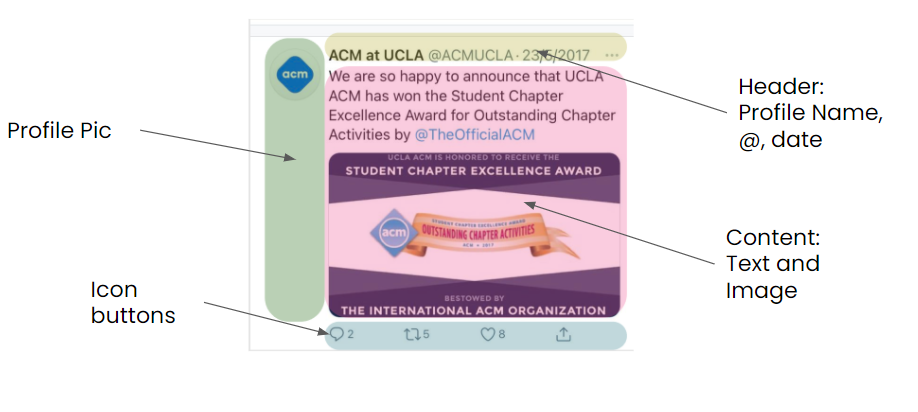
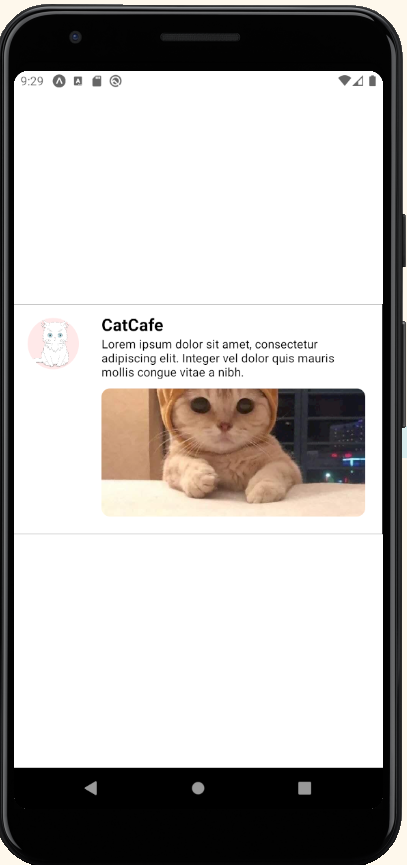
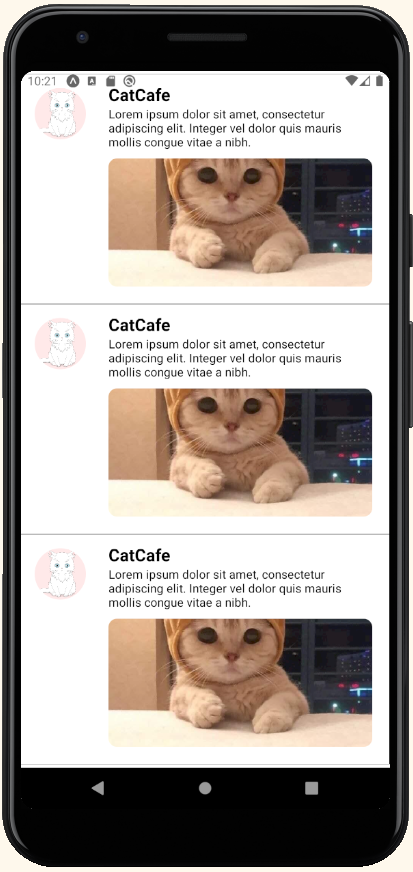
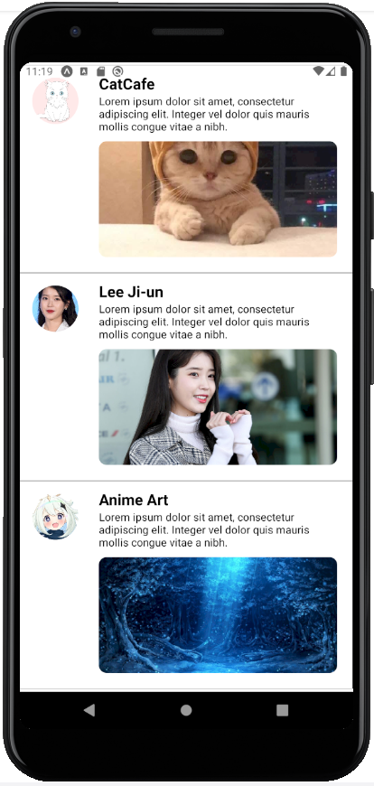
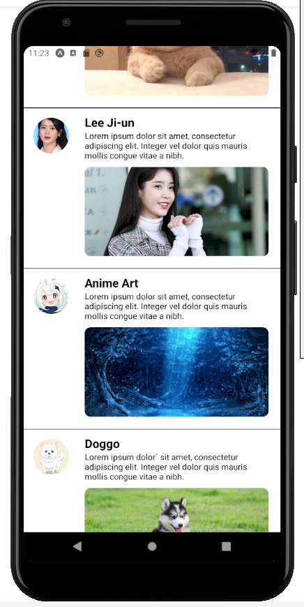
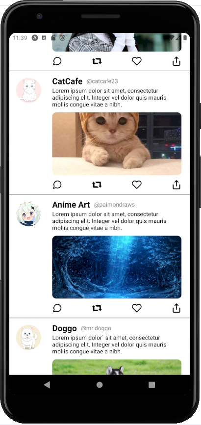
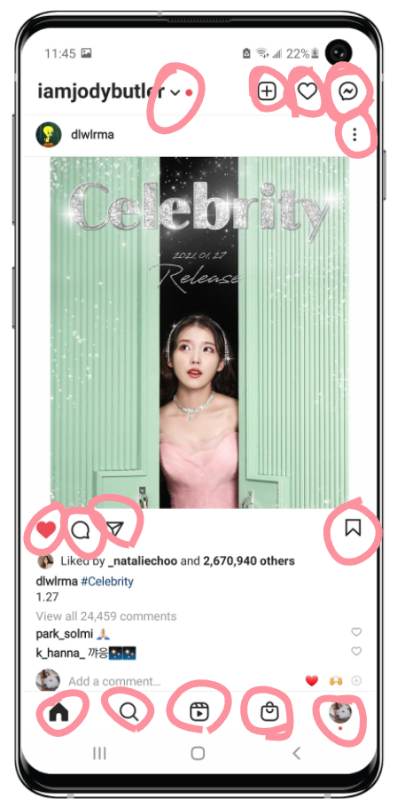
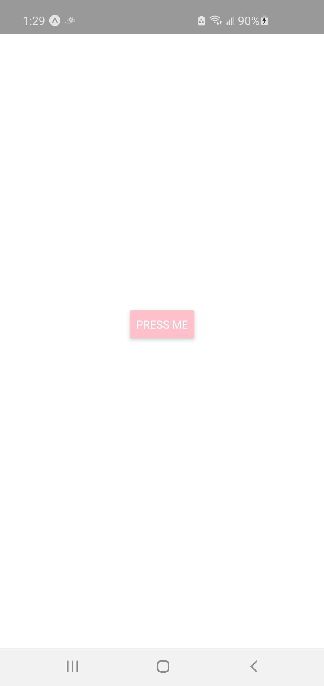
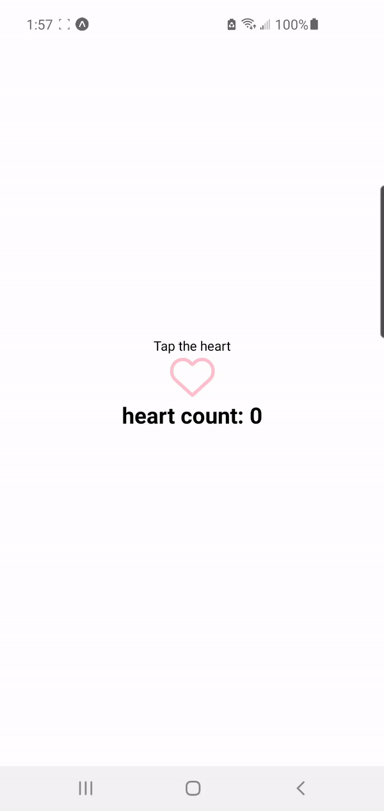
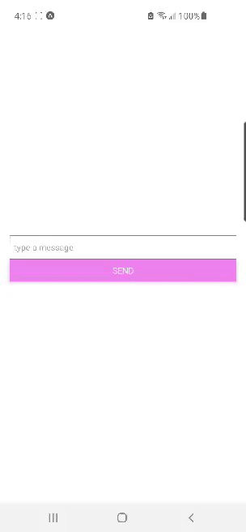

# Hacksprint Session 3: Controllable and User Interactive Components

**Date**: January 27, 2021

**Location**: Zoom

**Teachers**: [Alex Xia](https://github.com/khxia), [Jody Lin](https://github.com/jodymlin)

## Resources

- <a href="https://tinyurl.com/hacksprint21-s2-slides" target="_blank">Slides</a>
- <a href="https://members.uclaacm.com/login" target="_blank">ACM Membership Attendance Portal</a>
- <a href="https://docs.expo.io/get-started/installation/" target="_blank">Expo Installation</a>
- <a href="https://code.visualstudio.com/download" target="_blank">Text Editor (VS Code)</a>

## What we'll be learning today
- [Recap](#recap)
- [Demo: Breaking Down Twitter](#demo-breaking-down-twitter)
- [Functional Components](#functional-components)
- [Props](#props-in-react)
- [Button/Touchable Opacity](#button-and-touchableopacity)
- [Component state](#component-state-using-usestate) 
- [Text Input](#textinput)

## Recap

Last week, we learned about various different **components** in React Native. These included:

- View
- Text
- Image
- SafeAreaView
- FlatList
- StyleSheet
- Icons (Third Party Components)

## Demo: Breaking down Twitter

Now that we've learned a bit about these components. Let's try analyzing Twitter and see what components it can be broken down into. 


Above, we have a screenshot of Twitter app. From what we can see so far, it seems to be wrapped some sort of `<SafeAreaView>` since the app doesn't seem to be intruding on other areas of the phone (eg. status bar). 


Going further down a layer, we can see that the screenshot can be broken down into a navigation bar and a home feed. The latter of which is probably made up of some sort of `<FlatList>` since we are able to scroll down to view all the twitter posts that appear on our home feed. 


Diving deeper down into the home feed, we can see that it is made up of many "Tweets" stacked on top of each other. Each Tweet is independent from one another, meaning that even if you deleted a Tweet, or changed its contents, other Tweets won't be affected. This is an important way of thinking - and that is to compartmentalize each Tweet such that one doesn't affect the other. We will see later how this way of thinking is achieved through functional components.



But first, lets break down a single Tweet and see what it is made up of. From the image above, we can see that we can break a Tweet into a series of `<View>` components, each containing `<Image>`, `<Text>`, and Icon components. Then we can deduce that these views are probably styled using some kind of flexbox to make our Tweet look like it does now. 

Now, that we've broken down Twitter into the basic components, why not test our theory by trying to make our own Twitter?


### Coding our own ~~Twitter~~ Fwitter a.k.a Fake Twitter

In this demo, we are going to try to recreate the home feed of Twitter. So let's get started with a blank template. In our `App.js` file, we should first wrap everything in a `<SafeAreaView`. Afterwards, if we look at our Tweet diagram, we can surmise that we should create an overall `<View>` for a single Tweet, and then within that view, we have two views: one for the profile picture, and another for the profile name, post content - the text of our tweet, and post picture - the picture that we include in our tweet. So our App.js file may look something like this:

```js

import { StyleSheet, Text, View, SafeAreaView, FlatList, Image } from 'react-native';

export default function App() {
  return(
    <SafeAreaView> 
      <View> // A single Tweet
        <View> // For the profile pic
        </View>

        <View> // For our profile name, post content and post picture
        </View>
      </View>
    </SafeAreaView> 
  );
}
```

Of course, nothing is going to show on our app if we just have views in it, so lets add the text and the images, and then add some styling.

```js
import { StyleSheet, Text, View, SafeAreaView, FlatList } from 'react-native';

export default function App() {
  return(
    <SafeAreaView style={styles.container}> 
      <View style={styles.postContainer}>
        <View style={styles.profileContainer}>
        <Image 
          style={styles.profilePic}
          source={{
            uri: "https://www.animeoutline.com/wp-content/uploads/2018/07/anime_cat.png"
          }}
        />
        </View>
        <View style={styles.postContentContainer}>
            <Text style={styles.profileName}>CatCafe</Text>
            <Text>
              Lorem ipsum dolor sit amet, consectetur adipiscing elit. 
              Integer vel dolor quis mauris mollis congue vitae a nibh. 
            </Text>
            <Image 
              style={styles.postPic}
              source={{
                uri: "https://i.pinimg.com/736x/33/32/6d/33326dcddbf15c56d631e374b62338dc.jpg"
              }}
            />
        </View>
      </View>
    </SafeAreaView> 
  );
}
```

<details closed>
<summary>Click here to see the boring styling</summary>
<br>

```js
const styles = StyleSheet.create({
    container: {
      flex: 1,
      backgroundColor: '#fff',
      alignItems: 'center',
      justifyContent: 'center',
    },
    postContainer: {
      flexDirection: 'row',
      alignItems: 'flex-start',
      justifyContent: 'flex-start',
      width: '100%',
      padding: 10,
      borderWidth: 0.5
    },
    profileContainer: {
      padding: 6,
      width: '20%'
    },
    postContentContainer: {
      width: '80%',
      paddingHorizontal: 10,
    },
    profilePic: {
      width: 60,
      height: 60,
      borderRadius: 30
    },
    profileName: {
      fontSize: 20,
      marginRight: 10,
      fontWeight: 'bold'
    },
    postPic: {
      width: '100%',
      height: 150,
      marginVertical: 10,
      borderRadius: 10
    },
  });
```

</details>




Great! That's one Tweet down, let's hurry up and do the rest! Wait a minute. Do we just copy and paste all of the code above for each and every Tweet? No! That would not be a very smart move. So what do we do? We use something called functional components.


## Functional Components

Turns out, we can create our own custom components using React and JSX. This is called a functional component. Then, we can import and use them just like any other component!

So lets say that we had a file in the same directory as `App.js` called `TwitterPost.js`. Inside `TwitterPost.js`: 

```js
// TwitterPost.js

function TwitterPost() {
  return(
    /* JSX code here */
  )
}

export default TwitterPost
```

And then in our `App.js` file, all we need to do is:

```js
// App.js
import TwitterPost from './TwitterPost.js';

export default function App() {
  return(
    <SafeAreaView>
      <TwitterPost />
    </SafeAreaView>
  )
}
```

Voila! That's how we can create and use components in React. This method of grouping a bunch of components into one component is one of the key ideas of React. It is common convention to name the filename that contains the code for your component the same name as the component itself.

If you are sharp, you will notice that we did to `TwitterPost` looks kind of similar to the line `export default function App() {` in `App.js`, and you are right! The `App()` function that we were working with all this time is actually a pre-provided functional component that holds all other components and is the final component that is displayed in our app.


### A note about importing and exporting in JavaScript

One of the important takeaways from the previous section was how we exported and imported the components. And that is with the `export default MyComponent` and `import MyComponent from Pathname`. For now, all you should know is that this is one of the main ways of using code from another file in our project in JavaScript. If you want to make a component that you defined in one file, available in another file, you will need to export and import it. 

### Applying this to the Demo

Now that we've learned what functional components are, we can go ahead and apply it to our Fwitter demo!

In the same directory as `App.js`, create a new file called `TwitterPost.js`. All we need to do is copy the code that we had inside of `App.js` into it. It should look something like this:

```js
// TwitterPost.js

import { StyleSheet, Text, View, FlatList } from 'react-native';

function TwitterPost() {
    return (
        <View style={styles.postContainer}>
        <View style={styles.profileContainer}>
        <Image 
          style={styles.profilePic}
          source={{
            uri: "https://www.animeoutline.com/wp-content/uploads/2018/07/anime_cat.png"
          }}
        />
        </View>
        <View style={styles.postContentContainer}>
            <Text style={styles.profileName}>CatCafe</Text>
            <Text>
              Lorem ipsum dolor sit amet, consectetur adipiscing elit. 
              Integer vel dolor quis mauris mollis congue vitae a nibh. 
            </Text>
            <Image 
              style={styles.postPic}
              source={{
                uri: "https://i.pinimg.com/736x/33/32/6d/33326dcddbf15c56d631e374b62338dc.jpg"
              }}
            />
        </View>
      </View>
    );
}
```

And then in our `App.js` file, all we need to do is:
```js
import { SafeAreaView, FlatList } from 'react-native';
import TwitterPost from './TwitterPost.js';

export default function App() {
  return(
    <SafeAreaView style={styles.container}>
      <TwitterPost />
      <TwitterPost />
      <TwitterPost />
    </SafeAreaView>
  )
}
```



Great, look at how clean our code looks now! But wait, if we want to make our posts different, we have to create a new functional component for every single post. That does not solve our initial problem of repeating code. So how do we achieve this? Through props. 

## Props in React

If you look at our functional components, you will notice they are, well, functions. That's why they're called functional components. And if functions in JavaScript can take arguments, why can't functional components?

That is what props in React does. Props stand for 'properties' and they are used to pass in data from one component to another. 

Let's take a normal function called `sayHello`:

```js
function sayHello(name) { // In this case, name is an object with member variables first and last. 
	console.log('Hello, ' + name.first + ' ' + name.last);
}
```

We can then call this function like so:

```js
sayHello({ first: 'Nareh', last: 'Agazaryan'});  
// Hello, Nareh Agazaryan

sayHello({first: 'Miles', last: 'Wu'});  
// Hello, Miles Wu
```

This seems very intuitive. So what does props actually look like? Well, in fact, you've been using props without even realizing it. Remember an `<Image>` component. You would pass in properties into the markup when defining an image like so:

```js
<Image
  style={styles.img}
  source={{
    uri: "https://i.pinimg.com/736x/33/32/6d/33326dcddbf15c56d631e374b62338dc.jpg"
  }}
/>
```

In fact, `style` and `source` are props to the `Image` component! This is how React passes data from one component to another. Or, if you want to use more fancy terminology, it is how React passes data from a **parent** component to a **child** component.

So how do we use props in our own custom components? Well, the syntax looks like this:

In our `App.js` file, if we pass in properties to our `TwitterPost` component just like `Image` component like so:

```js
<TwitterPost 
  prop1="blah blah blah"
  prop2="uwu"
/>
```

In our `TwitterPost.js` file, we modify our `TwitterPost` component:

```js
function TwitterPost(props) {
  return(
    /* JSX code here */
    <Text>{props.prop1}</Text>
    <Text>{props.prop2}</Text>
  )
}
```

As we can see, similar to `name`, `props` is now an object whose member variables are the properties that we passed in to the component.

### Applying this to the Demo

That's great! Let's apply it to our demo. 

Overall, we can think of 4 things that we want to be customizable for any individual Tweet: the profile picture, the profile name, the post content, and the post picture. So in our `App.js` file, we can specify this:

```js
// App.js
export default function App() {
  return(
    <SafeAreaView style={styles.container}>
      <TwitterPost
        profileName="CatCafe"
        profilePic="https://www.animeoutline.com/wp-content/uploads/2018/07/anime_cat.png"
        postContent="Lorem ipsum dolor sit amet, consectetur adipiscing elit. Integer vel dolor quis mauris mollis congue vitae a nibh."
        postPic="https://i.pinimg.com/736x/33/32/6d/33326dcddbf15c56d631e374b62338dc.jpg"
      />
      <TwitterPost 
        profileName="Lee Ji-un"
        profilePic="https://media.allure.com/photos/5d601b3e531caa0008cbc17c/3:4/w_1279,h_1705,c_limit/IU%20at%20a%20press%20conference.jpg"
        postContent="Lorem ipsum dolor sit amet, consectetur adipiscing elit. Integer vel dolor quis mauris mollis congue vitae a nibh."
        postPic="https://static.billboard.com/files/2020/05/iu-feb-2020-billboard-1548-1589305869-1024x677.jpg"
      />
      <TwitterPost 
        profileName="Anime Art"
        profilePic="https://i.pinimg.com/474x/50/70/10/5070101ae7cc267a1ba03d30abdd38e9.jpg"
        postContent="Lorem ipsum dolor sit amet, consectetur adipiscing elit. Integer vel dolor quis mauris mollis congue vitae a nibh."
        postPic="https://i.pinimg.com/originals/f7/fe/c0/f7fec03ec36ff391848b5bc607c0578c.jpg"
      />
    </SafeAreaView>
  )
}
```
And then in `TwitterPost.js`, we simply add in the `props` argument and swap out all the hardcoded data. Remember to use the `{}` curly bois!

```js
function TwitterPost(props) {
    return (
        <View style={styles.postContainer}>  
        <View style={styles.profileContainer}>
          <Image 
            style={styles.profilePic}
            source={{
              uri: props.profilePic
            }}
          />
        </View>
        <View style={styles.postContentContainer}> 
            <Text style={styles.profileName}>{props.profileName}</Text>
            <Text>
            {props.postContent}
            </Text>
            <Image 
                style={styles.postPic}
                source={{
                    uri: props.postPic
                }}
            />
        </View>
      </View>
    );
}
```



Looking good! We have managed to incorporate props into our custom components. The last issue that we need to fix is the scrolling. Casting ourselves back to session 2, we put all of our data into an array and then use a `<FlatList>`.

```js
//App.js

const contentlist = [
  {
    id: 1,
    profileName: 'CatCafe',
    profileHandle: '@catuwu',
    profilePic: "https://www.animeoutline.com/wp-content/uploads/2018/07/anime_cat.png",
    postContent: "Lorem ipsum dolor sit amet, consectetur adipiscing elit. Integer vel dolor quis mauris mollis congue vitae a nibh. ",
    postPic: "https://i.pinimg.com/736x/33/32/6d/33326dcddbf15c56d631e374b62338dc.jpg"
  },
  {
    id: 2,
    profileName: 'Lee Ji-un',
    profileHandle: '@xxxIUxxx',
    profilePic: "https://media.allure.com/photos/5d601b3e531caa0008cbc17c/3:4/w_1279,h_1705,c_limit/IU%20at%20a%20press%20conference.jpg",
    postContent: "Lorem ipsum dolor sit amet, consectetur adipiscing elit. Integer vel dolor quis mauris mollis congue vitae a nibh. ",
    postPic: "https://static.billboard.com/files/2020/05/iu-feb-2020-billboard-1548-1589305869-1024x677.jpg"
  },
  {
    id: 3,
    profileName: 'Anime Art',
    profileHandle: '@paimondraws',
    profilePic: "https://i.pinimg.com/474x/50/70/10/5070101ae7cc267a1ba03d30abdd38e9.jpg",
    postContent: "Lorem ipsum dolor sit amet, consectetur adipiscing elit. Integer vel dolor quis mauris mollis congue vitae a nibh. ",
    postPic: "https://i.pinimg.com/originals/f7/fe/c0/f7fec03ec36ff391848b5bc607c0578c.jpg"
  },
  {
    id: 4,
    profileName: 'Doggo',
    profileHandle: '@mr.doggo',
    profilePic: "https://www.animeoutline.com/wp-content/uploads/2018/05/anime_dog_drawing.png",
    postContent: "Lorem ipsum dolor` sit amet, consectetur adipiscing elit. Integer vel dolor quis mauris mollis congue vitae a nibh. ",
    postPic: "https://filmdaily.co/wp-content/uploads/2020/05/dog-videos-lede-1300x868.jpg"
  }
]

export default function App() {
  return (
    <SafeAreaView style={styles.container}>
      <FlatList
        data={contentlist}
        renderItem={(obj) => {
          return(
            <TwitterPost profileName={obj.item.profileName}
            profileHandle={obj.item.profileHandle}
            profilePic={obj.item.profilePic}
            postContent={obj.item.postContent}
            postPic={obj.item.postPic}
            />
          )
        }}
        keyExtractor={item => item.id.toString()}
      />
    </SafeAreaView>
  );
}
```



And there we go! We have finished our Fwitter app. Honestly, it doesn't really look like Twitter at all but that's fine! That can be an exercise for you! I have actually gotten ahead and added a few of details that I didn't have time for today. You can have a look at the code in the [repo](https://github.com/uclaacm/hack-sprint-w21/tree/master/session-3-controllable-and-user-interactive-components/twitter-demo). The final product looks something like this:




## Button and TouchableOpacity
One of the most common components any mobile application is a button. 



Above we can see that in any instagram post, there are at 
least 14 buttons that we can click and interact with.

### Button Component
React native has a `Button` component that compiles
into the phone platform's native button code. So a button will
turn into the default iOS button on an iphone and the android
button on an android phone.

A generic use of the `Button` component looks like this:
```js
import { Button } from 'react-native';

function SuperDopeButton() {
  return (
    <Button
      onPress={someFunction}
      title='Press me'
      color='pink'
    />
  )
}
```
`Button` takes in a few important props that determine what 
the button looks like and does when it is pressed.

**onPress**
  * takes in a function. This function is called when the 
  button is clicked. 

**title**
  * takes in a string that displays as the button text. 
  
**color**
  * determines the color of the button

> More useful props can be found in the [React Native Docs for Buttons](https://reactnative.dev/docs/button)

Rendering this in `App.js` might look something like this. 
(Styling may vary and appear slightly different on your
device.) 



> Note: this button was rendered on an android device. 
The button will look slightly different for an iOS device.

This is all fine and dandy until we go back to our Instagram
screenshot and realize that 0/14 buttons contain text.


To solve this issue, we use another component that functions
like a button but allows us to put any component inside.

### TouchableOpacity
`TouchableOpacity` is a component that acts like a `View` 
component that can be clicked like a button. 

This makes 
`TouchableOpacity` powerful because we get the clickable
properties buttons have while having the ability to customize
the `TouchableOpacity` however we please. We can add `Text`,
`Image`s, icons, and even other `View`s inside.

A sample usage of `TouchableOpacity` might look something
like this:
```js
<TouchableOpacity
  onPress={someFunction} // call function when pressed
  >
  <Text>Press Here</Text>
  {/* or some image, icon, View, etc. */}
</TouchableOpacity>
```

`TouchableOpacity` is used like a regular `View` here, but
we've got the extra `onPress` property that will let us
call `someFunction` whenever the `TouchableOpacity` is 
pressed.

> More usefule properties of TouchableOpacity can be
found in the [React Native docs on TouchableOpacity](https://reactnative.dev/docs/touchableopacity)

## Component state (using `useState`)

### Motivation: Intro
Now that we've learned how to use buttons, let's try make
a button that will increment a counter on our screen. 

Here's a demo of what we want in our button counter:




### Motivation: Naive attempt with props
If the heart counter value is passed to this component
via props, we might be tempted to write a function like this

```js
const incrementHeartCount = () => {
  props.heartCount += 1;
}
```

This, however, will not work. Props are _read-only_ meaning
that they cannot be changed within the component. 

### Motivation: Naive attempt with variable
We can try big brain around the read-only rules of props
by storing the prop value in a variable. 

```js
function HeartCounter(props) {
  let myHeartCount = props.heartCount; // copy prop value

  const incrementHeartCount = () => {
    myHeartCount += 1; // increment here 
    console.log('myHeartCount:' + myHeartCount);
  }
  return <Text>heart count: {myHeartCount}<Text>
}
```

When we try to call `incrementLikeCount` by pressing
a button (or some other way), we'll notice that the 
rendered(shown on the screen) text doesn't change. 

If we check the logs in the console, we'll see that the value
is changing. However, our `Text` will be stuck at the same
initial value.

This is because React doesn't know that part of the component
has updated. When React detects a component has updated (ex:
the props passed are changed), React will re-render (redraw) the
component to reflect the new data.

However, in our code above, React doesn't detect the
change in value of our defined `myHeartCount` variable and
our app will not show the count incrementing. 


To solve this issue, we turn to an important concept
called **state**.

### state with `useState`
Using **state** within a component will allow us to change
the value of a state variable, which React will then detect
as a change and re-render. 

To use state we first must import the `useState` function.
> This function is part of a group of React functions called
"hooks". Hooks are special functions in React components that
allow us to have a deeper interation with our function
components. For now, don't worry about the terminology. We 
will learn more hooks in future workshops and gain an
understanding of what a "deeper interaction" with components
mean.

```js
import React, { useState } from 'react';
```

We'll use this in our function component like this:
```js
import React, { useState } from 'react';
function HeartCounter() {
  const [ heartCount, setHeartCount ] = useState(0);

  return <Text>heart count: {heartCount}</Text>
}
```

Let's break down how we use `useState`. 

**Return value:** `useState` returns a 2 item array. These
items are

1. a variable initialized to the value passed into the parameter of `useState`
1. a function that is used to update the first variable

This funky syntax `[ heartCount, setHeartCount ]` is a 
convenient way to _extract_ these values. It is equivalent
to the following code:
```js
const heartStateArray = useState(0);
const heartCount = heartStateArray[0];
const setHeartCount = heartStateArray[1];
```

However, you will never see state defined and written 
this way. The array items are always just extracted using
the syntax `[ heartCount, setHeartCount ]`.

> The names of the variable and function can be anything. 
However, the convention of `[ varName, setVarName ]` is very
common to see. 


**Updating the state variable**: To update the state variable,
we just call the function returned from `useState` with the
new value passed in as the parameter. 

```js
import React, { useState } from 'react';
function HeartCounter() {
  const [ heartCount, setHeartCount ] = useState(0);
  /* ... */
  setHeartCount(999); // sets heartCount to 999
  /* ... */
}
```
To use this in a button, we could use this code:
```js
import React, { useState } from 'react';
function HeartCounter() {
  const [ heartCount, setHeartCount ] = useState(0);

  // call this function when we press the button
  const incrementHeartCount = () => {
    // change the value of the heartCount state variable
    setHeartCount(heartCount + 1);
  }

  return (
    <View>
      <Button
        onPress={incrementHeartCount}
        title='Like'
      />
      <Text>heart count: {heartCount}</Text>
    </View>
  );
}
```

When this code is run, we'll see the `Text` component
updating to show the new value of `heartCount` every time
we click the `Button`. 

> The code above will display something slightly different 
than the demo gif at the beginning of this section, but
the idea of changing the state is the same. 

### Some other notes about state
There are a few important pointers about state to be aware
of.

1. state must be defined at the **outermost-level** of a function
(aka it cannot be inside any if-statments, loops, or in the 
return value section.) 
  ```js
  function Uwu() {
    if (true) {
      const [ yikes, setYikes ] = useState(0); // ERROR 
    }
    
    for (let i = 0; i < 3; i++) {
      const [ oof, setOof ] = useState(true); // ERROR
    }
    
    const [ uwu, setUwu ] = useState('uwu'); // CORRECT

    return (
      <View>
        {/* ERROR */}
        {const [ stonks, setStonks ] = useState('no');}
      </View>
    )
  }
  ```

  2. `useState` only works within _functional_ components. 
  (These are the type of components we've been teaching
  in this workshop.) You may see in other online tutorials
  that you can make components using JavaScript classes. 
  State in class components is managed differently though 
  and `useState` will not work there.

  2. You can use multiple state variables within a component.
  ```js
  import React, { useState } from 'react';
  function Owo() {
    const [ boop, setBoop ] = useState('hi');
    const [ yeet, setYeet ] = useState('ew');
  }
  ```

### Summary: state
We can use state in our components by importing and using
`useState`. This function returns 

1. a state variable intialized to the value passed into the
`useState` function
1. a function to update the state variable

React will re-render our components to display the data
of updated state. 


## TextInput
Another useful application of component state is with
text input boxes. These look like this:



This is possible using the `TextInput` component of React
Native.

An example of `TextInput` in action:
```js
import React, { useState } from 'react';
import { Text, TextInput, View, StyleSheet } from 'react-native';

function App() {
  const [ text, setText ] = useState('');
  return (
    <View style={styles.container}>
      <Text>{text}</Text>
      <TextInput
        style={styles.textInput}
        placeholder='type a message'
        onChangeText={(input) => setText(input)}
        value={text}
      />
    </View>
  )
}

const styles = StyleSheet.create({
  textInput: {
    width: '100%',
    height: 40,
    padding: 8,
    borderColor: 'grey',
    borderWidth: 1
  },
  container: {
    flex: 1,
    width: '100%',
    justifyContent: 'center',
    alignItems: 'center'
  }
});
```
The result of this code looks like this:


For more information on other cool properties of `TextInput`
that you can use, check out the [React Native Docs for 
Text Input](https://reactnative.dev/docs/textinput)


## Conclusion
We've learned a lot today and its important to get practice
with these new concepts to fully understand them. Check
out the demo folders from this session above to try
these out for yourself :)
