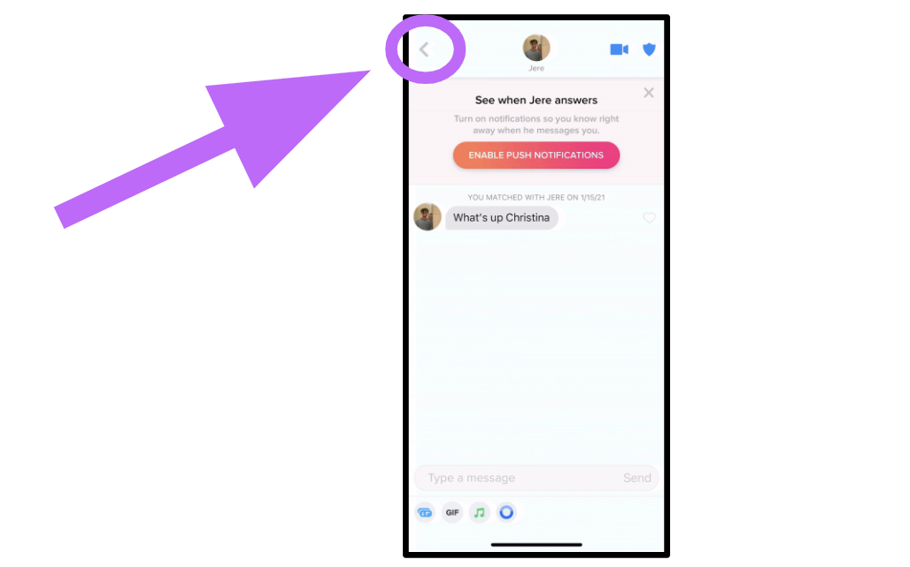
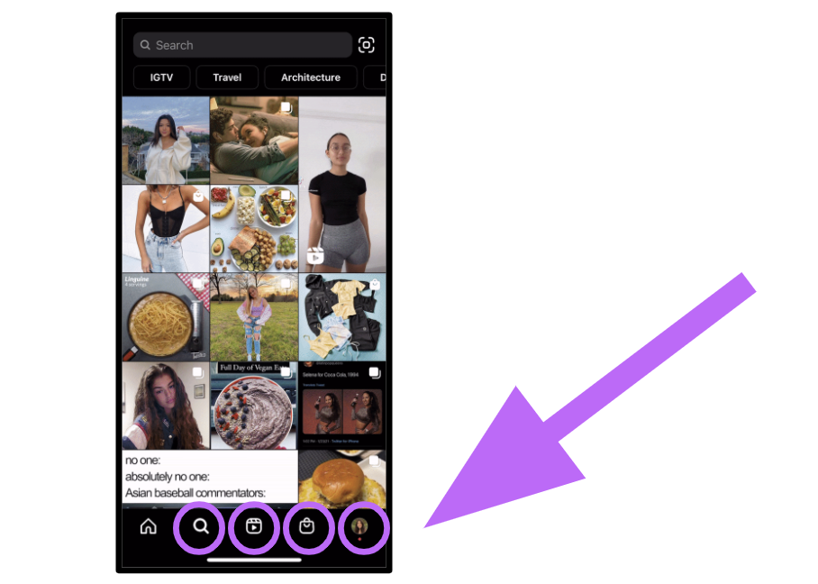

# Hacksprint Session 4: Intro to React Navigation

**Date**: February 3, 2021

**Location**: Zoom

**Teachers**: [Christina Tong](https://github.com/christinatong01), [Kristie Lim](https://github.com/kristielim)

## Resources

- <a href="https://tinyurl.com/hacksprint21-s2-slides" target="_blank">Slides</a>
- <a href="https://members.uclaacm.com/login" target="_blank">ACM Membership Attendance Portal</a>
- <a href="https://docs.expo.io/get-started/installation/" target="_blank">Expo Installation</a>
- <a href="https://code.visualstudio.com/download" target="_blank">Text Editor (VS Code)</a>
- <a href="https://reactnavigation.org/docs/getting-started" target="_blank">React Navigation Documentation</a>

## What we'll be learning today

- [Hacksprint Session 4: Intro to React Navigation](#hacksprint-session-4-intro-to-react-navigation)
  - [Resources](#resources)
  - [What we'll be learning today](#what-well-be-learning-today)
  - [Introduction](#introduction)
  - [Stack Navigation](#stack-navigation)
    - [What is a stack navigator?](#what-is-a-stack-navigator)
    - [Stack navigator analogy](#stack-navigator-analogy)
    - [Important functions](#important-functions)
    - [Code Demo](#code-demo)
  - [Tab Navigation](#tab-navigation)
    - [What is a tab navigator?](#what-is-a-tab-navigator)
    - [Important functions](#important-functions-1)
    - [Code Demo](#code-demo-1)
  - [Drawer Navigation](#drawer-navigation)
  - [Nested Navigation](#nested-navigation)
  - [Options](#options)
    - [Header Styles](#header-styles)
    - [Screen options](#screen-options)
    - [Replacing tab bar text with icons](#replacing-tab-bar-text-with-icons)

## Introduction

React Navigation is a library for routing and navigation in React Native apps. This means you can use it to switch between screens of your app.

To install React Navigation:

```
expo install @react-navigation/native
```

Then install some dependencies:

```
expo install react-native-gesture-handler react-native-reanimated react-native-screens react-native-safe-area-context @react-native-community/masked-view
```

There are more detailed instructions at the documentation here: https://reactnavigation.org/docs/getting-started

You will also need to install navigator(s) depending on the type you use. For example, to install the stack navigator:

```
expo install @react-navigation/stack
```

If you ever get errors such as "Unable to resolve module", this means that you haven't installed the module yet.

## Stack Navigation

### What is a stack navigator?

Below, you will see that the back arrow is highlighted. This is because, on a stack navigator, we add a new screen on top of another and have the option to go back.



### Stack navigator analogy

A stack navigator is much like a stack of books. We can add a book to the top of our stack and also remove that book. These actions are just like navigating to a new active screen and then going back to the original screen by closing the active screen. Another way to think about this is with the stack data structure.

### Important functions

```js
createStackNavigator();
```

- Provides a basic way to transition between screens
- Accepts props such as name, component, etc

```js
navigation.goBack();
```

- Close active screen and return to the one below on the stack
- Function is called on navigation prop

### Code Demo

We will have two screens, one called Wilderness Explorer, and the other called Explorer Profile.

Let's talk about our first screen, Wilderness Explorer (shown below).

```js
// stack.js

import React from "react";
import { StyleSheet, Text, View, Animated, Button } from "react-native";
import { createStackNavigator } from "@react-navigation/stack";

function WildernessExplorer({ navigation }) {
  return (
    <View style={{ flex: 1, justifyContent: "center", alignItems: "center" }}>
      <Text>Wilderness Explorers Screen</Text>
      <Button
        title='Go to Explorer Profile'
        onPress={() => navigation.navigate("My Explorer Profile")}
      />
    </View>
  );
}
```

This function takes in the navigation prop and styles it with the correct JSX tags. The Button component containes two props, one called title and one called onPress. onPress is a function that deals with how our screens will be connected. We call the navigate function on our navigation prop upon pressing the Button to route the user to 'My Explorer Profile'.

Let's talk about our second screen now, Profile(shown below).

```js
// stack.js

function Profile({ navigation }) {
  return (
    <View style={{ flex: 1, justifyContent: "center", alignItems: "center" }}>
      <Text>My Explorer Profile Screen</Text>
      <Button title='Go back' onPress={() => navigation.goBack()} />
    </View>
  );
}
```

This function has the same concepts as the function we previously talked about.

Now, we need a way to put these together within a stack navigation container. I will create another function called MyStack.

```js
const Stack = createStackNavigator();

function MyStack() {
  return (
    <Stack.Navigator>
      <Stack.Screen
        name='Wilderness Explorers!'
        component={WildernessExplorer}
      />
      <Stack.Screen name='My Explorer Profile' component={Profile} />
    </Stack.Navigator>
  );
}
```

My two screens for the stack navigator are indicated with Stack.Screen tag, and these are contained within Stack.Navigator tag. Lastly, I will export the function MyStack and import it within my App.js for it to display.

## Tab Navigation

### What is a tab navigator?

A tab navigator is probably the most commonly used navigation technique in React Native.



### Important functions

```js
createBottomTabNavigator();
```

- Provides a basic way to transition between screens with the tab method
- Accepts props such as name, component, etc
- Very similar to the function for creating a stack navigator

### Code Demo

We will have two screens, one called Wilderness Explorer, and the other called Explorer Profile, just like we did the demo for stack navigation

Let's talk about our first screen, Wilderness Explorer (shown below).

```js
// tab.js

import React from "react";
import { StyleSheet, Text, View, Animated, Button } from "react-native";
import { createBottomTabNavigator } from "@react-navigation/bottom-tabs";

function WildernessExplorers() {
  return (
    <View style={{ flex: 1, justifyContent: "center", alignItems: "center" }}>
      <Text>Wilderness Explorers Screen!</Text>
    </View>
  );
}
```

This function just deals with styling the screen.

Now, onto our second screen, Profile (shown below).

```js
// tab.js

function Profile() {
  return (
    <View style={{ flex: 1, justifyContent: "center", alignItems: "center" }}>
      <Text>My Explorer Profile Screen</Text>
    </View>
  );
}
```

Again, this function just deals with styling the screen.

Finally, we have to put these all together within a tab navigation container, so I will create one more function called MyTabs (shown below).

```js
// tab.js

function MyTabs() {
  return (
    <Tab.Navigator>
      <Tab.Screen name='Wilderness Explorers' component={WildernessExplorers} />
      <Tab.Screen name='My Explorer Profile' component={Profile} />
    </Tab.Navigator>
  );
}
```

My two screens for the stack navigator are indicated with Tab.Screen tag, and these are contained within Tab.Navigator tag. Lastly, I will export the function MyTabs import it within my App.js for it to display.

## Drawer Navigation

## Nested Navigation

You usually will be using more than one navigator in a single app. One common pattern is to have an overall tab navigator and a stack navigator as one of the tabs. We call this "nested navigation". The pattern from before can be done by passing in a navigator into the `component` prop instead of a screen. For example, if we have stack navigator called `MyStack`, we can pass it in as the component of one of the screen's tabs.

```jsx
<Tab.Navigator>
  <Tab.Screen name='Explore' component={MyStack} />
  <Tab.Screen name='Settings' component={SettingsScreen} />
</Tab.Navigator>
```

## Options

The default styles for a navigator are serviceable but you'll likely want to replace them with your own customized styles. We'll go over some of the options here but for a full list, you can check out the [React Navigation docs](https://reactnavigation.org/docs/stack-navigator#options).

### Header Styles

In general, we specify custom styles using the `options` prop, which is passed into a screen. We can specify header styles using the following properties:

- `headerStyle`: This is a JS object with styles that describe the header as a whole, for example the background color.
- `headerTitleStyle`: This is a JS object with styles that describe the header text, for example the font weight.

```jsx
<Stack.Screen
  name='Wilderness Explorers'
  component={Home}
  options={{
    headerStyle: {
      backgroundColor: "orange",
    },
    headerTitleStyle: {
      fontWeight: "bold",
      color: "white",
    },
  }}
/>
```

### Screen options

If you want the options to be the same across all the screens for a particular navigator, you can set the `screenOptions` prop on a navigator. If you set more specific options on a screen, these will override the navigator screen options. In this example, when both the navigator and the screen sets the `backgroundColor` style, the screen option is more specific so the background color is set to red.

```jsx
<Stack.Navigator
  screenOptions={{
    headerStyle: {
      backgroundColor: "orange",
    },
    headerTitleStyle: {
      fontWeight: "bold",
      color: "white",
    },
  }}
>
  <Stack.Screen
    name='Wilderness Explorers'
    component={Home}
    options={{
      headerStyle: {
        backgroundColor: "red",
      },
    }}
  />
  <Stack.Screen name='My Explorer Profile' component={Profile} />
</Stack.Navigator>
```

### Replacing tab bar text with icons

First you need to remove the text by setting the `showLabel` property on `tabBarOptions` to `false`.

```jsx
<Tab.Navigator
    tabBarOptions={{
        showLabel: false,
    }}
>
```

Next I will import the icons I want to use using the `vector-icons` library from a previous workshop.

```js
import { MaterialIcons } from "@expo/vector-icons";
```

Next I will set the `tabBarIcon` option on each screen to specify an icon to show. `tabBarIcon` is a function that returns a component.

```jsx
<Tab.Screen
    name='Explore'
    component={MyStack}
    options={{
        tabBarIcon: () => (
            <MaterialIcons name='explore' size={40} color='black' />
        ),
    }}
/>
<Tab.Screen
    name='Settings'
    component={SettingsScreen}
    options={{
        tabBarIcon: () => (
            <MaterialIcons name='settings' size={40} color='black' />
        ),
    }}
/>
```

Lastly, I want the icon to change if the icon is focused. I am using some special Javascript syntax here to extract the focused property from the object that is passed in as the argument.

```jsx
<Tab.Screen
    name='Explore'
    component={MyStack}
    options={{
        tabBarIcon: ({ focused }) =>
        focused ? (
            <MaterialIcons name='explore' size={40} color='red' />
        ) : (
            <MaterialIcons name='explore' size={40} color='black' />
        ),
    }}
/>
<Tab.Screen
    name='Settings'
    component={SettingsScreen}
    options={{
        tabBarIcon: ({ focused }) =>
        focused ? (
            <MaterialIcons name='settings' size={40} color='red' />
        ) : (
            <MaterialIcons name='settings' size={40} color='black' />
        ),
    }}
/>
```

Above is the way that you will most likely see this written but it may be easier to understand with the syntax below.

```jsx
<Tab.Screen
  name='Explore'
  component={MyStack}
  options={{
    tabBarIcon: (params) => {
      if (params.focused) {
        return <MaterialIcons name='explore' size={40} color='red' />;
      } else {
        <MaterialIcons name='explore' size={40} color='black' />;
      }
    },
  }}
/>
```
