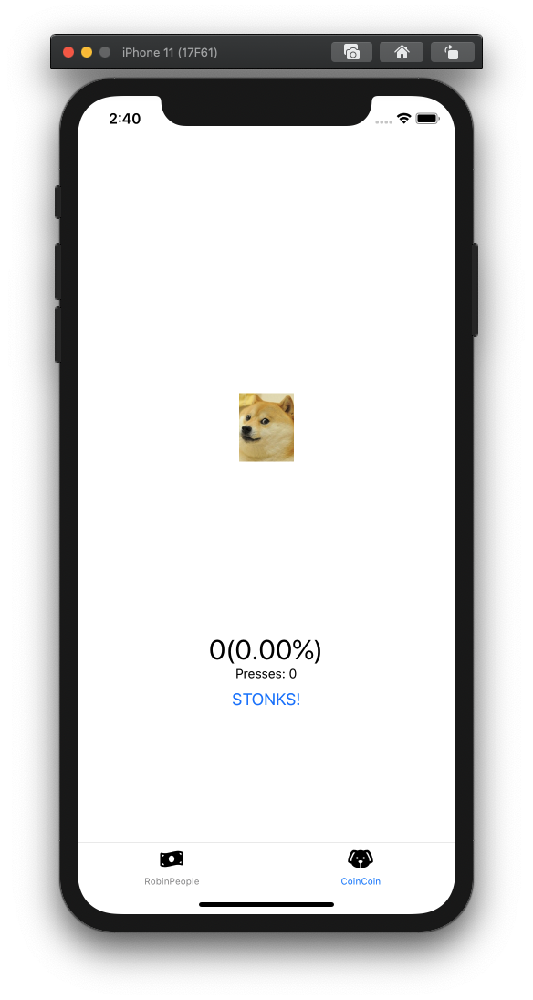
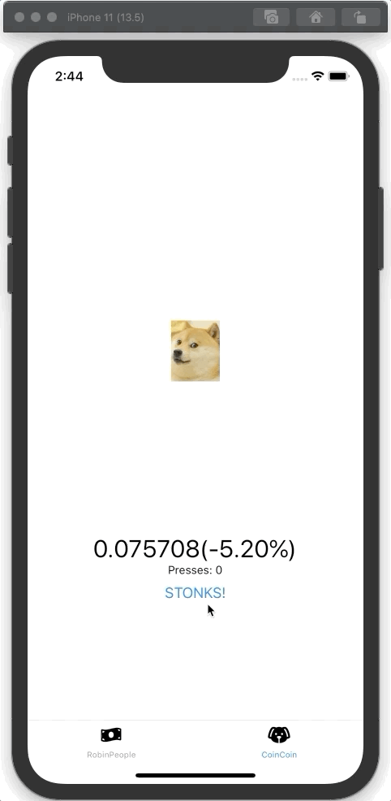
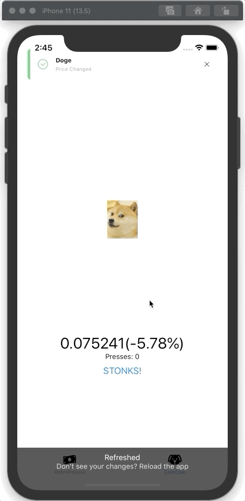

# Hacksprint Session 5: Asynchronous Programming and useEffect

**Date**: February 10, 2021

**Location**: Zoom

**Teachers**: [Einar Balan](https://github.com/EinarBalan), [Galen Wong](https://github.com/GalenWong)

## Resources

- [Slides](//TODO:link)
- [ACM Membership Attendance Portal](https://members.uclaacm.com/login)

## What we'll be learning today
- [What is Asynchronous Programming?](#what-is-asynchronous-programming)
- [Promises](#promises)
- [Async/Await](#asyncawait)
- [JSON](#json)
- [API's and fetch()](#apis-and-fetch)
- [useEffect()](#useEffect)

## What is Asynchronous Programming?

### Motivation for Async
You may not have realized it, but up until this point, you've been writing something called **synchronous** code. In synchronous code, each function or expression within your program is executed one at a time and in sequential order. 

A more digestible way to think about it: all of the expressions in your code are waiting in line, but they have to wait their turn to be served! The result: each task in your program (no matter how long it takes) is executed one by one.


And this is fine for a simple program where each task is completed super quickly! But what happens when a task is super resource intensive and takes a long time to complete? Well, if written synchronously, all the tasks that come after the resource hog will be stuck waiting for it to wrap up. This could potentially lead to a terrible UX, which we definitely don't want! How can we avoid that?

### Async in Practice
Enter async programming. Essentially what async programming allows us to do is add more "lines" so that more than one expression can be executed at a time. 

Imagine you're at the grocery store and you see this: 

Two lines: to your left there are 3 carts filled with tons of stuff and to your right nobody is in line.


Which line are you more likely to take? Obviously the empty one, right? On the left the shopper has all this garbage loaded into their carts and you have no idea how long it's going to take to scan each thing. If you get in line behind them, you could be waiting for hours. By taking the empty line, you save a lot of time! 

Async solves the same problem. If there is ever some task that could take a long time, but you're not sure how long (say a network request) you don't want to freeze up your application while waiting for it to complete! Async allows us to execute more than one expression at a time, so we no longer have to wait for the intensive task to complete before moving onto other things. 

## Promises
Alright, so now that you know what asynchronous programming is, let's get into how you might actually use it in the context of a React Native app. 

### Motivation for Promises

Let's say we have a function `simulateIntensiveTask()` that takes some amount of time to complete. When the task is completed, we should see a message in the console. The return value of the function is how long the task took to complete! Let's add the following to `handlePress()` to demonstrate a common problem in asynchronous programming:

```javascript
const handlePress = () => {
    const seconds = simulateIntensiveTask();
}
```

As expected, the task takes a couple seconds to complete! Now let's try to use the seconds value that the function returns.

```javascript
const handlePress = () => {
    const seconds = simulateIntensiveTask();
    console.log("Milliseconds: " + seconds * 1000);
}
```

But this results in something unexpected: why is the number of milliseconds NaN? And also, why is "The task took 3.32 seconds to complete. That was intense!" logged after the milliseconds log? Didn't we call `simulateIntensiveTask()` first? What is going on?

Okay, I have to confess something to you. I've been lying. I treated `simulateIntensiveTask()` as a synchronous function, when really it's asynchronous! This new knowledge makes our weird outputs make a *lot* more sense. Since `simulateIntensiveTask()` is asynchronous, it doesn't hold up our program and allows for all of the expressions that come after it to be executed before the task is completed. This leads to a problem, though: we don't yet know our seconds value when we log the number of milliseconds! To try to get to the bottom of this, let's take a couple steps back and just log our seconds value.

```javascript
const handlePress = () => {
    const seconds = simulateIntensiveTask();
    console.log(seconds);
}
```

This results in some scary looking think being output to the console: 

```
Promise {
  "_U": 0,
  "_V": 0,
  "_W": null,
  "_X": null,
}
```

Now we know why our example before output NaN, because that is *definitely* not a number. In fact, it's a promise!

### What is a Promise?
A promise is essentially just a wrapper for a value that might be unknown when the promise is created. In the previous example, when we log the number of seconds, we don't yet know how long the task took to complete, so the `seconds` variable must be a promise! That's why when we log `seconds` it prints out what we saw before, rather than a number.

That's great and all, but how can we actually get the value that we want (this is called resolving the promise)? We have a couple ways we can approach it. One is to use `.then()` which can be called on a promise.

Going back to our `simulateIntensiveTask()` example, since (as I mentioned before) the function returns a promise we can use `.then()` as follows:

```javascript
const handlePress = () => {
    simulateIntensiveTask().then(seconds => {
        console.log(seconds);
    })
}
```
What we pass into `.then()` is just a function that takes the resolved value of the promise (i.e. the value after we figure out what it is) as a parameter and then does whatever we want to do with it (in our case logging it to the console).

Alright, awesome! Now everything works as expected. 

## Async/Await
`.then()` is great, but it can get out of hand *really* quickly if you have a couple nested asynchronous actions. Lets instead explore a way of resolving the promise that is a little easier on the eyes, the glorious async/await: 

```javascript
const handlePress = async () => {
    const seconds = await simulateIntensiveTask();
    console.log(seconds);
}
```

Much cleaner right! Async/await lets you resolve promises while still writing your code in a way that looks similar to synchronous code. It's important to realize that under the hood we are still using promises when using async/await, but our syntax is just a lot nicer! I'll be using async/await for the rest of this workshop. 

Another important thing to note: the `await` keyword can only be used within functions that are declared asynchronous!

Alright, up to this point I've just been simulating intensive tasks, but how might we use async in the real world? Let's take a look.

## JSON
But first, let's do some review of an important Javascript concept: objects!

### Objects

Say we want an object that represents a certain cryptocurrency. Each cryptocurrency has a name, a current price, and a percentage that represents the change in its price over the last 24 hours. To do so we could write the following: 

```javascript
dogecoin = {
    price: 0.0592,
    change: 28.61,
};
```

To get each value within our object we can write the following:

```javascript
const price = dogecoin.price; // equals .0592
const change = dogecoin.change; //equals 28.61
```

OR


```javascript
const price = dogecoin["price"]; //equals .0592
const change = dogecoin["change"]; //equals 28.61
```

We can also have objects within objects!

```javascript
dogecoin = {
    price: 0.0592,
    tracker: {
        day: 28.61,
        week: 102.15,
        month: 504.77,
        year: 2009.38,
    }
};
```

And we can access values within that object in exactly the same way as shown above.

```javascript
const yearlyChange = dogecoin.tracker.year;
```

### Object Notation
Very often, it's useful to store these objects as string representations. This string representation of a javascript object is known as JSON, or JavaScript Object Notation. Converting from a JSON value to an object is really easy! To demonstrate here's what our `dogecoin` object would look like as JSON.

```JSON
{
"dogecoin": {
    "price": 0.0592,
    "tracker": {
        "day": 28.61,
        "week": 102.15,
        "month": 504.77,
        "year": 2009.39,
        }
    }
}
```

Pretty similar, right? That's what makes JSON so convenient. 

Alright, now that we know what async programming is, how to use it in Javascript with Promises and async/await, and what JSON is, let's put it all together!

## API's and fetch()
An example of an intensive task in the real world would be a network request. A **network request** is a way to get data that isn't stored locally over the internet (i.e. from a server). Very often, we use something called an **API** to interface with these servers! API's are very powerful in that they let use access data in an easy way! Using an API, we don't have to worry about all the details of how that data was produced, all we need to worry about is how we want to use it.

In order to trigger a network request in Javascript, we use the `fetch()` function. `fetch()` takes an API URL as a parameter and returns a promise (since we don't know how long it's going to take to get the data that we requested!). Since it returns a promise, we're going to have to resolve that promise in order to access the data we want! I'm going to use async/ await

```javascript
// within an async function
const result = await fetch('https://someurl.com/the-location-of-your-data');
```

After the promise is resolved, there is still one last step! We need to convert the returned object to a Javascript object using `.json()`, another asynchronous function.

```javascript
// within an async function
const result = await fetch('https://someurl.com/the-location-of-your-data');
const object = await result.json();
```

Now, we can access our requested data. Let's show how you might do this in a real project.

### Demo
Lately, the stock market and cryptos have been really popping off so I want to make an app that let's me keep track of my ~sound~ investments! Let's call it RobinPeople.

I took the liberty of setting up some starter code so we can focus on just the async stuff. Feel free to download it and mess around!


Obviously, we'll be dealing with the only investment that matters.

```javascript
<Text>DOGE</Text>
```

Let's make it so that when we press the update button, the price text is updated with the current price of dogecoin! We can do this using the fetch function. In order to get the current price, we're going to use an API from coingecko.com, a website that tracks cryptocurrency prices. 

It can be accessed through the following link: ['https://api.coingecko.com/api/v3/simple/price?ids=dogecoin&vs_currencies=usd&include_24hr_change=true']('https://api.coingecko.com/api/v3/simple/price?ids=dogecoin&vs_currencies=usd&include_24hr_change=true')

```javascript
const dogeCoinApiUrl = 'https://api.coingecko.com/api/v3/simple/price?ids=dogecoin&vs_currencies=usd&include_24hr_change=true';

const RobinPeople = () => {
    const [price, setPrice] = useState(0);

    const updatePrice = () => {
        const result = await fetch(dogeCoinApiUrl);
        const json = await result.json();
        setPrice(json.dogecoin.usd);
    }

    return (
        <SafeAreaView style={styles.container}>
            <Text style={styles.title}>RobinPeople</Text>
            <View style={styles.priceContainer}>
                <Text>DOGE</Text>
                <Text style={styles.price}>${price.toFixed(4)}</Text>
                <MoneyButton 
                    onPress= {updatePrice}
                    title="Update"
                />
            </View>
        </SafeAreaView>
    );
}
```

Alright, this is working pretty nicely! Now, let's take a look at some more cool ways to use API's with `useEffect()`.

## useEffect()

You are pretty familiar with `useState` now (if not, visit our previous
session). It is now time to introduce you to a new hook from React called
`useEffect`. To learn this, let's build an app called `CoinCoin` that let you
check the price of doge coin because we love [crypto-currency and
memes](https://markets.businessinsider.com/currencies/news/dogecoin-price-crypto-reddit-traders-satoshistreetbets-trigger-copycat-wsb-rally-2021-1-1030015774).

In this section, we continue to work with the same code base. Now we move to
the file `CoinCoin/CoinCoin.js`, and navigate to the CoinCoin tab in your
emulator or your phone. 

We start off with a simple component that doesn't really do anything, other
than showing you 0.

```jsx
export default function CoinCoin() {
  const [numPress, setNumPress] = useState(0);
  const [price, setPrice] = useState(0);
  const [change, setChange] = useState(0);

  return (
    <View style={styles.container}>
      <StatusBar style="auto" />
      <Toast ref={(ref) => Toast.setRef(ref)} />
      <Doge numPress={numPress} />
      <Text style={styles.price}>{price}({change.toFixed(2)}%)</Text>
      <Text>Presses: {numPress}</Text>
      <Button title="STONKS!" />
    </View>
  );
}
```

<figure align=center>



<figcaption>

_What you should see at the beginning without writing a single line of code in CoinCoin_
</figcaption>
</figure>

On the top of the file, we have declared a constant string that contains a
URL. This is an API that returns you the current price of dogecoin in US$ and
its percentage change since 24 hours ago. 

```js
const dogeCoinApiUrl = 'https://api.coingecko.com/api/v3/simple/price?ids=dogecoin&vs_currencies=usd&include_24hr_change=true';
```

If you open this URL in the browser, you will get something that looks like this:

```json
{
  "dogecoin": {
    "usd": 0.052405,
    "usd_24h_change": 62.493060243475654
  }
}
```

Let's warm up by writing a function that calls the API.

```js
async function getPriceAndChange() {
  const resp = await fetch(dogeCoinApiUrl);
  const body = await resp.json();
  return {
    price: body.dogecoin.usd,
    change: body.dogecoin.usd_24h_change,
  };
}
```

### First use of `useEffect`: do something once when component is initially rendered

Now, we want the API to be called once the user open the app. We don't want
the user to press a button to get the price. It is simply too much work. As a
good app developer, we gotta make our user experience superb.

Let's figure out how to do this. Well, why don't we simply call the function
`getPriceAndChange` and set our state, simple!


```js
export default function CoinCoin() {
  const [numPress, setNumPress] = useState(0);
  const [price, setPrice] = useState(0);
  const [change, setChange] = useState(0);

  /* SPOILER: this is WRONG ❌ */
  const data = await getPriceAndChange();
  setPrice(data.price);
  setChange(data.change);

  return (
    <View style={styles.container}>
      <StatusBar style="auto" />
      <Toast ref={(ref) => Toast.setRef(ref)} />
      <Doge numPress={numPress} />
      <Text style={styles.price}>{price}({change.toFixed(2)}%)</Text>
      <Text>Presses: {numPress}</Text>
      <Button title="STONKS!" />
    </View>
  );
}
```

JavaScript is going to complain! Remember, we __CANNOT__ use `await` inside a
function that is not `async`. However, JavaScript never say we cannot call 
an `async` function without `await`. Let's try making a `async` function inside 
the component `CoinCoin` and calling it without await!

```js
export default function CoinCoin() {
  const [numPress, setNumPress] = useState(0);
  const [price, setPrice] = useState(0);
  const [change, setChange] = useState(0);

  const getAndSetData = async () => {
    console.log('loading the price...');
    const data = await getPriceAndChange();
    setPrice(data.price);
    setChange(data.change);
  };
  getAndSetData(); // no `await` here, totally allowed

  return (
    <View style={styles.container}>
      <StatusBar style="auto" />
      <Toast ref={(ref) => Toast.setRef(ref)} />
      <Doge numPress={numPress} />
      <Text style={styles.price}>{price}({change.toFixed(2)}%)</Text>
      <Text>Presses: {numPress}</Text>
      <Button title="STONKS!" />
    </View>
  );
}
```

Okay... that's works. We get our newest price. But noticed how many
times our function gets called! 

```
loading the price...
loading the price...
loading the price...
loading the price...
```

Our function get called 4 times! This means it is making 3 unnecessary API
calls and wasting our user's bandwidth. Oh no, the users will hate us if our
app consumes all their data in their phone plan. Let's figure out why. 

- When the component renders initially, `getAndSetData` is called first
(__1st time__).
- When the first data arrives, we call `setPrice(data.price)`. When a state
is updated, our component renders. When it is rendered, the function is
called again (__2nd time__). 
- This time, the price is the same as the old price, so no update from
`setPrice` happens. However, `setChange` is now called and set a new value.
State change triggers render, render triggers `getAndSetData` (__3rd time__).
- Where the 4th update comes from is uncertain. It is possibly that the
`setChange` from the second update that triggered a forth update. 


The problem is that whenever any state is updated, our function
`getAndSetData` gets called. This is a problem because we only want it to be
called once the component load. It is even worse if the price changes
frequently. It will trigger an infinite re-render. 

> Takeaway: Whenever state changes, the component re-renders.


### Concept of __side effect__

Our function `getAndSetData` has a side effect. When the function is called,
it changes our state! A side effect happens when a function modifies data or
state outside of its scope. In our case, the state of our component, which is
outside the function, gets changed. We do not want side effect to happen
inside our component because it leads to the problem of over re-rendering,
potentially infinite re-rendering.

To deal with side effects in React components, we use the hook `useEffect`. 

```js
useEffect(fn, deps);
```

`useEffect` takes in a function as the first parameter, which is the function
that has a side effect. The second parameter `deps` specifies an array of
dependencies, which tells React when to perform the side effect. We will come
back to this second parameter later.


To make sure that our `getAndSetData` gets called only once at the beginning,
we all it in `useEffect` with an empty array.

```js
useEffect(() => {
  getAndSetData();
}, []);
```

> 🚩 Checkpoint: at this point, your CoinCoin app should display the current
> price of doge coin when loaded.

### Second use of `useEffect`: reacting to changes

As crypto investors, our users definitely want to keep up with price changes
all the time. As application developers, we want our user to stay on our app
by using some feedback mechanism. The two combined gave us the greatest
invention of all time: ~~Tik Tok~~ an doge meme that moves when you press the
button. We only call the API and update the price after user presses 5 times. 


First, we add a listener on the button to increment our `numPress` state.

```jsx
<Button title="STONKS!" onPress={() => { setNumPress(numPress + 1); }} />
```

At this point, you should see your doge movin~

To execute our `getAndSetData` only on the 5th press of the button, 
we make use of our dependency array of `useEffect`.

```jsx
useEffect(() => {
  if (numPress >= 5) {
    getAndSetData();
    setNumPress(0);
  }
}, [numPress]);
```

Whenever the variable `numPress` changes, the function that we pass to
`useEffect` gets called. After `getAndSetData` is called, we set `numPress`
back to 0 again. This use case of `useEffect` really gives us an idea on how
to understand `useEffect`. `useEffect` is a hook that is used to execute side
effect on certain state changes.


<figure align=center>



<figcaption>

_What CoinCoin should look like at this point_
</figcaption>
</figure>

However, this approach has a problem. If you notice, our number of press is 
set to 0 before our new number arrives. The reason is that we are calling 
the async function `getAndSetData` but we are not waiting for it to complete 
with `await` therefore the `setNumPress(0)` gets executed. To go around this 
issue, we create another async function.


```jsx
useEffect(() => {
  const getSetDataResetNumPress = async () => {
    await getAndSetData();
    setNumPress(0);
  }
  if (numPress >= 5) {
    getSetDataResetNumPress();
  }
}, [numPress]);
```

> 🚩 Checkpoint: at this point, your CoinCoin app should call the API
> when it is pressed 5 times.

The concept of "reacting to changes" maybe hard to wrap your head around.
Let's do one more example so you understand this better. We notice that our
price doesn't necessarily change when user press it all the time. Let's make
it easier for the user to notice the change in price. We will be using a library 
called `react-native-toast-message` to pop a message when the price change. 

Again, to execute something on a state change, we use `useEffect`. We are
watching over the change of the variable `price`. Therefore, it should exists
in our dependency array.


```jsx
useEffect(() => {}, [price]);
```

To make a notification, we call the function `Toast.show` with our message.

> Note: `Toast` is provided by the library `react-native-toast-message` so we 
> can create notification with the function call `.show()`.

```jsx
useEffect(() => {
  Toast.show({ text1: 'Doge', text2: 'Price Changed' });
}, [price]);
```

That's it. This `useEffect` watches over `price`. When the `price` change,
the function is called and a message is shown to the user.

> 🚩 Checkpoint: at this point, your CoinCoin app should notify you when the
> price changes.


<figure align=center>



<figcaption>

_What you should see when price changes_
</figcaption>
</figure>

## Timing things and `useEffect` 

Although clicking and watching the doge spin is fun, some user might want to
have our app fetch the latest price for dogecoin every 10 second or so. 
How can we accomplish that? We introduce a function `setInterval`. 

```js
setInterval(func, m);
```

`setInterval` is a function that takes in a function and a number as
parameters. For every `m` millisecond, the function `func` will be executed.
By calling `setInterval`, you are scheduling a call to `func` every `m`
milliseconds.

Okay, so we can call `getAndSetData` every 10 seconds

```js
setInterval(() => {
  getAndSetData();
}, 1000 * 10);
```

If you simply put this inside a component, it is wrong. The piece of code
contains side effects. Whenever the component renders, `setInterval` is
called and it schedule another calls to `func` every `m` milliseconds.

Again, we only want to do this once for the first time the component renders.
We want to use `useEffect(f, [])` here! 

```js
useEffect(() => {
  setInterval(() => {
    getAndSetData();
  }, 1000 * 10);
}, []);
```

> 🚩 Checkpoint: at this point, your CoinCoin app should call the API once
> every 10 seconds.

## Other uses of `useEffect`

Apart from making API calls, there are other common use cases of the
`useEffect` hook. For example

- Detect whether the user is in the current tab or not. See code snippet here: https://reactnavigation.org/docs/navigation-events/#navigationaddlistener
- Used to construct and invoke animation in React Native. See example here: https://reactnative.dev/docs/animations#animated-api
- We can make search bar suggestions more efficient, by constructing a debounce in hooks: https://hack.uclaacm.com/posts/fall2019/js-chats-3/#application-power-of-hooks-with-debouncing


For those of you who has background in writing React class components, you
can view the 2 `useEffect` use cases we just talked about as
`componentDidMount` and `componentDidUpdate`. For a more comprehensive
introduction to hooks from a class perspective, check out [JavaScript Chats:
A Gentle Introduction to React
Hooks](https://hack.uclaacm.com/posts/fall2019/js-chats-3/).

## Some additional challenges for improving CoinCoin

1. (Difficulty: ✦✦) Notice that our app notify us of a price change when we
first load the app. Can we prevent the notification on the first call to the
API, while still notifying the user of any subsequent updates?

1. (Difficulty: ✦✦✦) When price change, can we also tell how much the price
change was? For this, you need to somehow keep track of the previous state. 
You can certainly derive your own solution, but can we use some hooks that 
other people has already built... 

1. (Difficulty: ✦✦✦✦✦✦✦) When we navigate away from our CoinCoin tab, the
request to API still executes every 10 seconds. Can we stop the the API
request when the user is on focused on the CoinCoin tab? For solving this 
problem, you need a good understanding of the following:
    - What does `setInterval` return?
    - What is `clearInterval`?
    - Inside the function we pass to `useEffect`, we can also return a function. How does that work?
    - What is the hook `useFocusEffect` from `@react-navigation/native`?
    - What is the hook `useCallback` from React?

