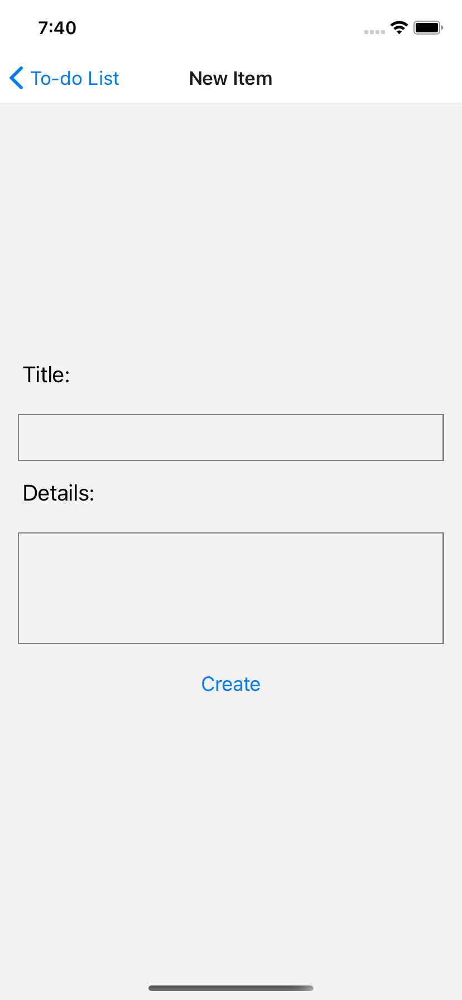
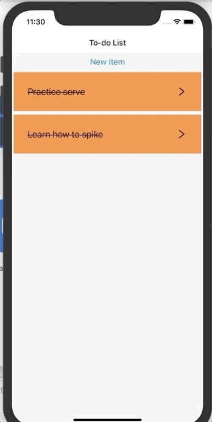
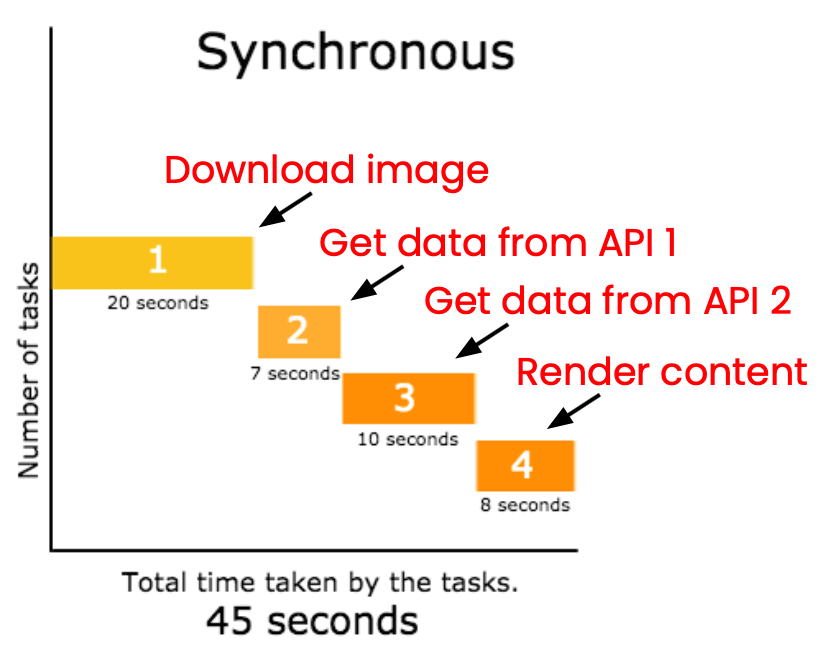
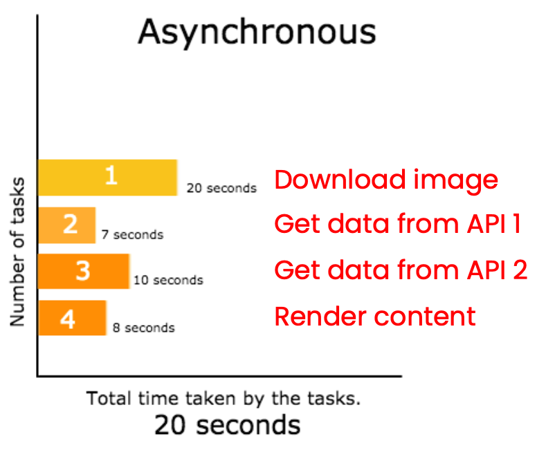
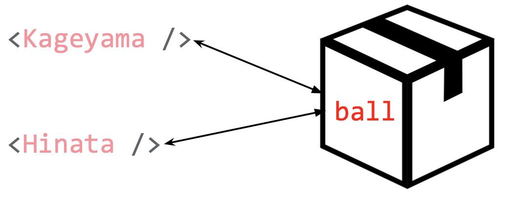
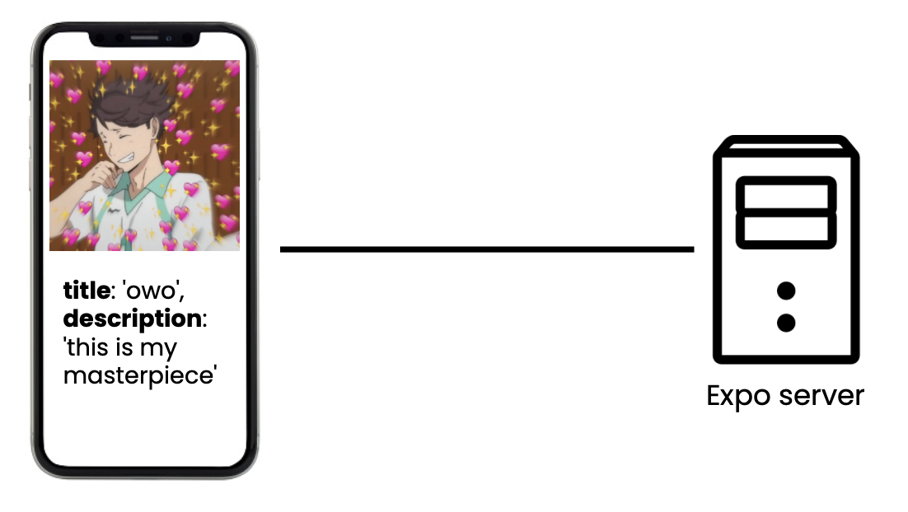
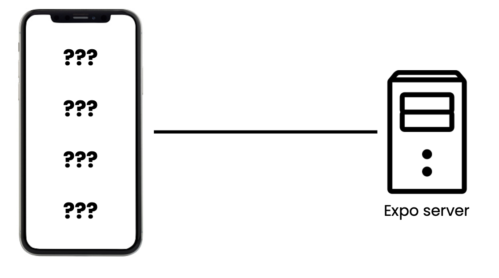
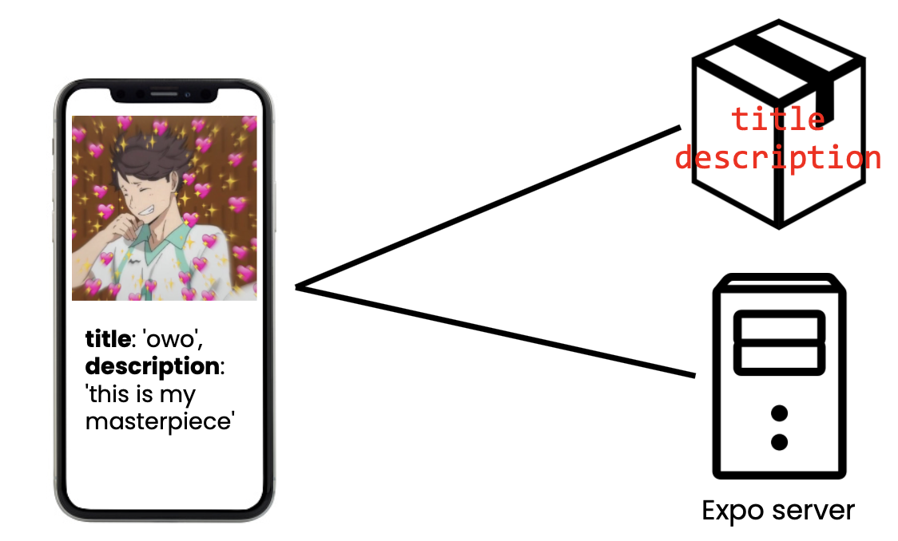
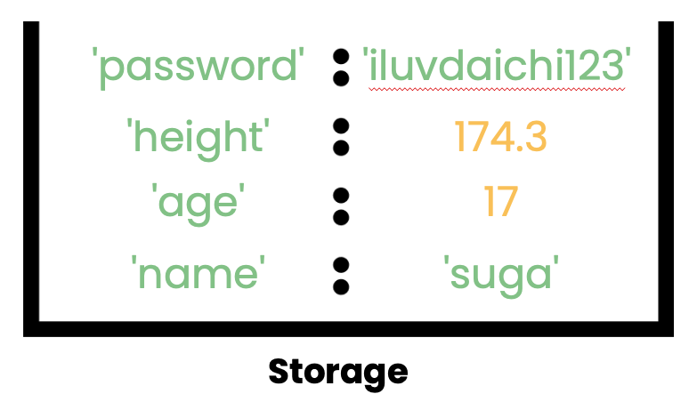
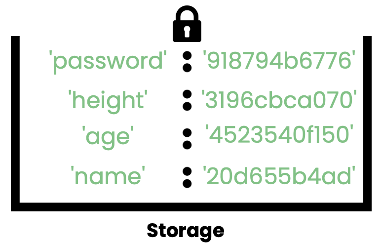

# Hacksprint Session 6: React Navigation with Data

**Date**: February 17, 2021

**Location**: Zoom

**Teachers**: [Kristie](https://github.com/kristielim), [Eugene](https://github.com/euglo)

## Resources

- [Slides](https://tinyurl.com/hacksprint21-s6-slides)
- [ACM Membership Attendance Portal](https://members.uclaacm.com/login)
- [React Navigation Docs](https://reactnavigation.org/docs/params#passing-params-to-a-previous-screen)
- [Example To-do List App from Stanford's CS47](https://snack.expo.io/@aabuhashem/a9e8d7)

## What we'll be learning today

Today we'll be walking through step-by-step how you might create a To-do list app. We'll start from the very beginning and review everything we've learned so far.

- [Hacksprint Session 6: React Navigation with Data](#hacksprint-session-6-react-navigation-with-data)
  - [Resources](#resources)
  - [What we'll be learning today](#what-well-be-learning-today)
  - [Syntactic Sugar](#syntactic-sugar)
    - [Object Destructuring](#object-destructuring)
    - [Array Spread](#array-spread)
    - [Optional Chaining](#optional-chaining)
  - [Review](#review)
    - [Getting started](#getting-started)
    - [Review props](#review-props)
    - [Review FlatList](#review-flatlist)
    - [Review state](#review-state)
    - [Review TextInput](#review-textinput)
    - [Review React Navigation](#review-react-navigation)
  - [Passing parameters between screens](#passing-parameters-between-screens)
  - [Challenges pt. 1](#challenges-pt-1)
  - [Review asynchronous programming](#review-asynchronous-programming)
  - [Review async/await](#review-asyncawait)
    - [Syntax](#syntax)
  - [Review useEffect](#review-useeffect)
    - [Syntax](#syntax-1)
  - [try...catch](#trycatch)
  - [Local Storage](#local-storage)
    - [Motivation: Case 1](#motivation-case-1)
    - [Motivation: Case 2](#motivation-case-2)
    - [Definition](#definition)
  - [AsyncStorage](#asyncstorage)
    - [Adding Data](#adding-data)
    - [Fetching Data](#fetching-data)
    - [Other Methods](#other-methods)
    - [Using AsyncStorage](#using-asyncstorage)
    - [Demo AsyncStorage](#demo-asyncstorage)
  - [SecureStore](#securestore)
    - [Motivation](#motivation)
    - [Adding Data](#adding-data-1)
    - [Fetching Data](#fetching-data-1)
    - [Other Methods](#other-methods-1)
    - [Using SecureStore](#using-securestore)
    - [Demo SecureStore](#demo-securestore)
  - [AsyncStorage vs. SecureStore](#asyncstorage-vs-securestore)
    - [Other Options](#other-options)
  - [Challenges pt. 2](#challenges-pt-2)

## Syntactic Sugar

Before getting started with today's content, let's talk a little bit about Javascript's newer syntax. These are pretty common to see in React, so we'll be going over them in case you see it out in the wild. Syntactic sugar is code syntax that is shorter or more concise than normal code syntax.

### Object Destructuring

Use object destructuring when you want to save properties of objects into variables of the same name. Take this example object:

```js
const episode = {
  number: 17,
  title: "The Iron Wall",
  teams: ["Date Tech", "Karasuno"],
};
```

Without object destructuring:

```js
const number = episode.number;
const title = episode.title;
const teams = episode.teams;
```

With object destructuring:

```js
const { number, title, teams } = episode;
```

Object destructuring is commonly applied to props.

Without object destructuring:

```js
function Episode(props) {
  return;
  <View>
    <Text>{props.title}</Text>
    <Text>{props.number}</Text>
  </View>;
}
```

With object destructuring:

```js
function Episode({ title, number }) {
  return;
  <View>
    <Text>{title}</Text>
    <Text>{number}</Text>
  </View>;
}
```

### Array Spread

Array spread, or the `...` operator, is a short way to copy the elements of an array into a second array. The alternative is to either use a loop to copy elements or built-in array methods such as `concat`.

```js
const arr = [1, 2, 3];

const arr1 = [...arr]; // [1, 2, 3]

const arr2 = [...arr, 4, 5]; // [1, 2, 3, 4, 5]

const arr3 = [0, ...arr]; // [0, 1, 2, 3]
```

### Optional Chaining

Use optional chaining to avoid errors that occur when you try to access keys on an object that is undefined. The optional chaining operator is `?.`.

Without optional chaining:

```js
if (episode) {
  return episode.title;
} else {
  return undefined;
}
```

With optional chaining:

```js
return episode?.title;
```

Optional chaining is most useful when you need to extract nested properties.

Without optional chaining:

```js
if (episode && episode.title) {
  return episode.title.name;
} else {
  return undefined;
}
```

With optional chaining:

```js
return episode?.title?.name;
```

If nothing in the chain is undefined, the value is returned.
If anything in the chain is undefined, undefined is returned.

## Review

This part will walk through setting up the app from what we've learned in previous workshops.

### Getting started

First, make sure [Node](https://nodejs.org/en/download/) and [Expo](https://docs.expo.io/) are installed. Then to start a new app, run this command in your terminal:

```
expo init TodoApp
```

This will install what you need to get started on an Expo app.

Now we're ready to make a To-do List app! What are some screens we might want? How about a list screen, list item screen, and create item screen.

<div style="display: flex; flex-direction: row;">



</div>

Apps usually have different folders to organize the code. This is better than keeping all your files in the top level folder or even more chaotic, all code in a single file. Let's set up a simple directory structure with a single folder called `screens`. You might want to create folders for shared constants (colors, sizes), assets (images, fonts), or [more](https://swairaq.medium.com/react-native-app-structure-f281e69d895d).

Then add the screen files with some filler code just to get started:

```js
import React from "react";
import { View, Text } from "react-native";

export default function ListScreen() {
  return (
    <View>
      <Text>List screen</Text>
    </View>
  );
}
```

### Review props

First let's review props. On my to-do list, I will want to have multiple list items. Each list item will have the same structure and styling, so it will be useful to break that out into a separate component. Then the content can be determined by props. Here I have two props: `title` and `done`. `title` is the text of the list item and `done` determines if the style should be crossed out or not. `done && styles.done` means that if `done` is true then the expression is `styles.done` otherwise it is nothing. This is a Javascript feature but very commonly found in React. Also notice here that I am pulling out the props in the parameters of the function here `function ListItem({ title, done }) {`. This is a shorthand so that you can just use `title` instead of `props.title`.

```js
import React from "react";
import { SafeAreaView, StyleSheet, Text, View } from "react-native";

function ListItem({ title, done }) {
  return (
    <View style={styles.listItem}>
      <Text style={[styles.listItemTitle, done && styles.done]}>{title}</Text>
    </View>
  );
}

export default function ListScreen() {
  return (
    <SafeAreaView>
      <Text style={styles.heading}>To-do List</Text>
      <ListItem title='Practice serve' done={false} />
      <ListItem title='Learn how to spike' done={true} />
    </SafeAreaView>
  );
}

const styles = StyleSheet.create({
  heading: {
    fontSize: 36,
    fontWeight: "bold",
    textAlign: "center",
    padding: 20,
  },
  listItem: {
    padding: 30,
    backgroundColor: "#ef863d",
    margin: 4,
  },
  listItemTitle: {
    fontSize: 20,
  },
  done: {
    textDecorationLine: "line-through",
  },
});
```

### Review FlatList

These list items should be in a FlatList so that we can scroll through them. Let's review how to do that. First let's put the data that we want into an array:

```js
const todos = [
  { title: "Practice serve", done: false },
  { title: "Learn how to spike", done: true },
];
```

This array will be used in the `data` prop of the `FlatList`. Then let's render a `ListItem` in the `renderItem` prop.

```js
<FlatList
  data={todos}
  renderItem={({ item, index }) => (
    <ListItem title={item.title} done={item.done} />
  )}
  keyExtractor={(item, index) => index.toString()}
/>
```

### Review state

Why can't I do something like this?

```js
function ListItem({ title, done }) {
  return (
    <TouchableOpacity
      style={styles.listItem}
      onPress={() => {
        done = !done;
      }}
    >
      <Text style={[styles.listItemTitle, done && styles.done]}>{title}</Text>
    </TouchableOpacity>
  );
}
```

I can't change `done` to the opposite of `done` because `done` is a prop. In order to change `done`, I need to use _state_ instead of props. I could have a state inside of `ListItem` that controls whether or not that list item is done.

```js
function ListItem({ title }) {
  const [done, setDone] = useState(false);
  return (
    <TouchableOpacity
      style={styles.listItem}
      onPress={() => {
        setDone(!done);
      }}
    >
      <Text style={[styles.listItemTitle, done && styles.done]}>{title}</Text>
    </TouchableOpacity>
  );
}
```

This would appear to work, but something is actually a little wrong. If we put state inside of the `ListItem`, we don't change the `todos` array. So instead, we will keep `done` as a prop and instead, pass in a `toggleDone` prop function that will update the `todos` state.

Change todos into state for the `ListScreen`.

```js
const [todos, setTodos] = useState([]);
```

Pass in a function that updates the `todos` to each `ListItem`.

```jsx
<ListItem
  title={item.title}
  done={item.done}
  toggleDone={() => {
    let newTodos = [...todos];
    newTodos[index].done = !newTodos[index].done;
    setTodos(newTodos);
  }}
/>
```

### Review TextInput

Now that we have our `ListScreen` complete, let's fill out the other screens too. In the `NewItemScreen`, we will need some text inputs to say what the new to-do list item will be.

```js
import React, { useState } from "react";
import {
  SafeAreaView,
  Text,
  TextInput,
  Button,
  StyleSheet,
} from "react-native";

export default function NewItemScreen({ navigation }) {
  const [title, setTitle] = useState("");
  const [details, setDetails] = useState("");
  return (
    <SafeAreaView style={styles.container}>
      <Text style={styles.label}>Title:</Text>
      <TextInput
        style={styles.textInput}
        value={title}
        onChangeText={setTitle}
        accessible={true}
        accessibilityLabel='Title of to-do list item'
      />
      <Text style={styles.label}>Details:</Text>
      <TextInput
        style={[styles.textInput, styles.paragraphInput]}
        value={details}
        onChangeText={setDetails}
        multiline={true}
        accessible={true}
        accessibilityLabel='Details of to-do list item'
      />
      <Button title='Create' />
    </SafeAreaView>
  );
}

const styles = StyleSheet.create({
  label: {
    fontSize: 20,
    paddingLeft: 20,
    paddingBottom: 8,
  },
  textInput: {
    fontSize: 20,
    height: 40,
    paddingHorizontal: 20,
    paddingVertical: 0,
    borderColor: "grey",
    borderWidth: 1,
    margin: 16,
  },
  paragraphInput: {
    height: 100,
  },
  container: {
    height: "100%",
    justifyContent: "center",
  },
});
```

Nothing happens when you click the button right now.

### Review React Navigation

Let's add the `ListItemScreen`:

```js
import React from "react";
import { SafeAreaView, Text, StyleSheet } from "react-native";

export default function ListItemScreen() {
  return (
    <SafeAreaView>
      <Text style={styles.title}>Practice serve</Text>
      <Text style={styles.done}>Not done yet</Text>
      <Text style={styles.details}>
        The Pinch Servers are switched into the game to get an advantage over
        the opponents or at crucial times, usually near match point. They have
        to perform risky serves to gain points for the team. The serves usually
        have to be extremely powerful or unique, such as the "Jump Float Serve,
        or the underhand Ceiling Serve (Tokyo Spring Nationals).
      </Text>
    </SafeAreaView>
  );
}

const styles = StyleSheet.create({
  title: {
    fontSize: 36,
    fontWeight: "bold",
    padding: 20,
  },
  done: {
    fontSize: 24,
    fontStyle: "italic",
    paddingLeft: 20,
    paddingBottom: 20,
  },
  details: {
    fontSize: 20,
    padding: 20,
  },
});
```



Now let's add some navigation between the three screens.

```
import React from "react";
import { SafeAreaView } from "react-native";
import { NavigationContainer } from "@react-navigation/native";
import { createStackNavigator } from "@react-navigation/stack";
import ListItemScreen from "./app/screens/ListItemScreen";
import ListScreen from "./app/screens/ListScreen";
import NewItemScreen from "./app/screens/NewItemScreen";

export default function App() {
  const Stack = createStackNavigator();
  return (
    <NavigationContainer>
      <Stack.Navigator>
        <Stack.Screen name='To-do List' component={ListScreen} />
        <Stack.Screen name='New Item' component={NewItemScreen} />
        <Stack.Screen name='List Item' component={ListItemScreen} />
      </Stack.Navigator>
    </NavigationContainer>
  );
}
```

Add a button to the `ListScreen` to allow you to get to the `NewItemScreen`.

```jsx
<Button title='New Item' onPress={() => navigation.navigate("New Item")} />
```

Add a function to the `ListItem` that allows you to get to the `ListItemScreen`.

```jsx
<ListItem
  title={item.title}
  done={item.done}
  toggleDone={() => {
    let newTodos = [...todos];
    newTodos[index].done = !newTodos[index].done;
    setTodos(newTodos);
  }}
  goToDetails={() => navigation.navigate("List Item")}
/>
```

Add a button to the `ListItem` and call the new `goToDetails` prop.

```jsx
import { AntDesign } from "@expo/vector-icons";

function ListItem({ title, done, toggleDone, goToDetails }) {
  return (
    <TouchableOpacity style={styles.listItem} onPress={toggleDone}>
      <View style={styles.listItemContent}>
        <Text style={[styles.listItemTitle, done && styles.done]}>{title}</Text>
        <AntDesign name='right' size={24} color='black' onPress={goToDetails} />
      </View>
    </TouchableOpacity>
  );
}
```

## Passing parameters between screens

Finally, let's pass data between the screens. This is done using the second argument of `navigation.navigate`.

```jsx
() => navigation.navigate("List Item", item);
```

Recall that `item` is a Javascript object that looks like:

```jsx
{
  title: "Practice serve",
  done: false,
  details:
    "Underhand: a serve in which the player strikes the ball below the waist instead of tossing it up and striking it with an overhand throwing motion. ",
}
```

Then in `ListItemScreen`, we have access to that `item` object through the `route` object passed in props. `route` has a property called `params` that contains the parameters that we passed from the `ListScreen`.

```jsx
export default function ListItemScreen({ route }) {
  const { title, done, details } = route.params;
  return (
    <SafeAreaView>
      <Text style={styles.title}>{title}</Text>
      <Text style={styles.done}>{done ? "Done" : "Not done yet"}</Text>
      <Text style={styles.details}>{details}</Text>
    </SafeAreaView>
  );
}
```

This is actually anti-pattern even though it does work. The recommended way is to only pass the id of a list item, and then in the `ListItemScreen`, read from the global store. This avoids duplication of data and will prevent bugs with inconsistent data.

## Challenges pt. 1

- Allow users to edit the list item from the list item screen.
- Add due dates to the to-do list

## Review asynchronous programming

In [last week's workshop](https://github.com/uclaacm/hack-sprint-w21/tree/master/session-5-async-and-life-cycle), we dipped our toes into the world of asynchronous programming. In **asynchronous programming**, different tasks in your app can be run _at the same time_. It avoids blocking or freezing your app on one task, and your code can be run out of order in a faster and more efficient way. The way it accomplishes this is by starting a resource-intensive task, leaving that task to perform another one while we wait for it to finish, then coming back to that intensive task once it's done.

Let's take a look at the following example, which showcases how _synchronous_ (sequential) programming, as opposed to asynchronous programming, looks like:



The flow of synchronous programming is something we might be more used to (time moves to the right). We run tasks _in order_, and we do not start the next task until the current task has run to completion. However, we can start to see how this is not the most efficient solution. For example, in the first block of time, we are downloading an image. Once we start the process of downloading an image, however, our app is completely idle, as it waits for the downloading process, which is separate from the app, to finish. Even though the app isn't doing anything, we are unable to start the next task, "Get data from API 1", until this current task is finished in synchronous programming. Although this entire process realistically will not take as long as 45 seconds as the diagram suggests (it's usually on the degree of milliseconds), it still goes to show that this solution is not optimal.

On the other hand, let's take a look at the same flow, but done asynchrously:



Using the asynchronous flow, we are now able to _start_ the process of downloading image, then jumping straight into another asynchronous task, "Get data from API 1", while the image is downloaded somewhere else. Then, once we start fetching the data from API 1, we can then jump into the task of getting data from API 2, and finally, rendering content, _all at the same time_. Using asynchronous flow, we are able to prevent the app from being idle at any point, constantly giving it work to do. And, as a result, this entire process now takes less than half of the time it used to.

## Review async/await

In JavaScript, one way to work with asynchronous code is through the `async`/`await` syntax. Using this syntax, we are able to write asynchronous code in a synchronous (sequential) looking way, which essentially means that we avoid constantly wrapping our code in deeper and deeper curly braces. `async`/`await` provides us with a way to work with **Promises**, which are objects that implement asynchronous-type programming in JavaScript. Promises wrap around any asynchronous code, and they signify that we may not know _when_ the surrounded code will finish, but when it _does_, we are able to extract its value.

### Syntax

As you may remember from [last week's workshop](https://github.com/uclaacm/hack-sprint-w21/tree/master/session-5-async-and-life-cycle), you _must_ add `async` to whatever function you want to work with asynchronous code in using `async`/`await`, like so:

```javascript
const f = async () => {
  // ... more code
};
```

Once we have an `async` function, we can now use `await` to _extract_ a value out of a Promise:

```javascript
const f = async () => {
  const value = await someAsyncTask(); // <-- returns a Promise
  console.log(value);
};
```

After we use `await` and assign the result to a variable, we can use that variable just as we would any other JavaScript variable.

Notice how this almost looks like normal, sequential JavaScript, with the exception of the `async` and `await` keywords. This is the power of `async`/`await`!

## Review useEffect

We also spent some time last week going over `useEffect`. `useEffect` is a React hook that takes in a function that performs **side effects**, which, in the context of React, perform computations and changes to variables or state _outside of_ the variables, constants, or functions the function normally has access to. Note that in programming, we call the variables, constants, and functions that the function normally has access to the **scope** of the function. Phrased this way, side effects perform changes to variables or state _outside of the scope_ of the function. Side effects are also effects we want to run in a consistent way _regardless_ of how many times a component may potentially get re-rendered. An example of a side effect is fetching data asynchronously from an outside source. This is a side effect, and we want it to only be fetched once at the _beginning_ of the component's life, as opposed to running it _every time_ the component renders. Another example is when we update the UI after the component has been rendered. Since this is done after the fact, it is considered a side effect, and should be done inside of `useEffect`.

### Syntax

The syntax for `useEffect` is as follows:

```javascript
useEffect(() => {
  // some computation w/ side effects
}, [variable]);
```

`useEffect` takes in two parameters. The first parameter is a function (our _effect_) that contains the computation we want `useEffect` to run. The second parameter is optional, and it is an array that contains the list of variables to watch out for. If any of the variables in the array change, then `useEffect` will re-run the function. In the case of the example above, if the variable named `variable` (my creativity is limitless) changes, `useEffect` will run the function again and deal with the state change accordingly.

The key to creating a `useEffect` that will only run _once_ when the component comes to life is using an _empty array_ as the second parameter:

```javascript
useEffect(() => {
  // some computation w/ side effects
}, []);
```

By putting an empty array here, we are letting JavaScript know that this function in the `useEffect` should only be run once right at the beginning. This kind of logic is perfect for anything we want to do as an initial setup, as is the case for data that we want to only fetch once.

## try...catch

So far, we have been using `async`/`await` assuming that everything in our asycnhronous code will go smoothly. But this isn't always the case! Sometimes, something can go horribly wrong in our asynchronous code, and we want a way to handle that. This is where the `try...catch` block comes in!

`try...catch`, as the name suggests, is a two-part statement, where the `try` block surrounds code that runs in the normal case (aka when everything runs smoothly) in curly braces `{}`. This is where we would put all the code we have previously worked with. On the other hand, if any errors come up (i.e. something goes terribly wrong in our Promise), we instead instantly jump into the `catch` block, which runs code that we will write to handle the error.

The syntax is as follows:

```javascript
try {
  const value = await someAsyncTask();
  console.log(value);
} catch (error) {
  console.log(error);
}
```

Notice that `catch` takes in a parameter, which we have named `error` here, but it can be named anything you want, as long as you use it consistently within the block. This parameter will contain information about what went wrong in the `try` blocks, and you can use it to debug.

## Local Storage

### Motivation: Case 1

Now, onto some new material! Once we learn about the benefits of local storage, we can start making our To-do list app really cool.

Firstly, why would we use Local Storage? In order to highlight its importance, let's say we are working with the following two functional components:

```javascript
function Kageyama() {
  const [ball, setBall] = useState("up");
  // more code…
}

function Hinata() {
  if (ball === "up") {
    // ERROR!!
    console.log("I am spiking the ball");
  }
  // more code...
}
```

This code won't work! `<Hinata />` is trying to check the value of the variable `ball` in the if statement, but it does not have access to `ball`, because it belongs to the state of `<Kageyama />`.

How should we go about fixing this issue? One way we could solve this is by making `<Hinata />` the child component of `<Kageyama />`, and passing down `ball` as a prop.

```jsx
function Kageyama({ navigation }) {
  const [ball, setBall] = useState("up");
  // more code…
  return <Hinata ball={ball} />;
}
```

The problem with this is that we are forced to create a parent-child relationship between these two components, where the "parent" component is the one containing the "child" component. This is not that flexible of a solution, especially if these two components belong to two completely separate concerns in our app.

Additionally, what if `ball` contained a _lot_ more data, say, in an object?

```jsx
function Kageyama() {
  const [ball, setBall] = useState({
    direction: "up",
    shape: "sphere",
    // and a bunch more…
  });
  // more code…
  return <Hinata ball={ball} />;
}
```

In this case, we're working with a _lot_ more data, and we're passing all of this redundant data into `<Hinata />` as well! This is quite a clunky way to approach passing data, and we should probably use a more elegant way to handle data between these two components.

Note: we could also use React Navigation to navigate to `<Hinata />` instead, but the issues that arise from both approaches are similar, so we'll stick to the props example instead.

Ideally, we should have a storage mechanism that is separate from these two components, like so:



This storage must be _globally accessible_, meaning the data within it can be accessed anywhere in the app. This is, in fact, what local storage is!

### Motivation: Case 2

As another scenario, let's take a look at this hypothetical fansite app I may or may not have actually built:



Our app is currently up and running on our Expo server. We currently have it so that the data you see - `title` and `description` - were both created within the app itself.

However, what if our app crashes, or our Expo server dies? Once the server becomes live again, or we refresh our app, we have lost all of our data!



My fansite!!! NOOOOOOO

Ideally, we want our data to still be available no matter what may happen to our app or server. In other words, we want our app data to _persist_. For this, local storage comes to the rescue again!



With all of this established, let's finally take a look at what local storage exactly is.

### Definition

As showcased above, **Local Storage** is a storage mechanism that allows us to store _persistent_ data _globally_ across the app. No matter which component we are currently in, it has access to local storage, making it _global_. Local storage allows the data it contains to _persist_, meaning that no matter what happens to our app or server, the data will still remain available. Finally, local storage is a singular source of data, meaning we avoid duplicating any data unnecessarily. In React Native, there are different implementations of local storage, but the ones we will focus on today are `AsyncStorage` and `SecureStore`.

## AsyncStorage

As its name suggests, `AsyncStorage` is an _asynchronous_ implementation of local storage, which means that the interface we use to add and fetch data will all be done asynchronously. It uses a key-value storage system. You may be more familiar with the key-value system within the context of JavaScript objects:

```javascript
const obj = {
  name: "Eugene",
  age: 20,
};
```

Here, `name` and `age` are the keys (properties), and `'Eugene'` and `20` are the values associated with those keys, respectively. `AsyncStorage` uses something very similar - you use a key (property) to obtain the value associated with that key. When you add data to the storage, you must include both the key and the value associated with that key.

### Adding Data

In order to add data using `AsyncStorage`, we use the `setItem()` method. `setItem()` takes two parameters: the key, which is a string, and the value.

```javascript
try {
  await AsyncStorage.setItem("ball", "up");
} catch (error) {
  console.log(error);
  // error adding data
}
```

Recall that we use `await` because `AsyncStorage.setItem()` is an asynchronous function.

Once we run this code, our storage will now contain an entry for 'ball', the value of which is 'up'.

### Fetching Data

To fetch data that we have added into `AsyncStorage`, we use the `getItem()` method. `getItem()` takes one parameter, which is the string key. Once `await`-ed, it `getItem()` will either return the value associated with that key, or `null` if that key does not exist within storage.

```javascript
try {
  const value = await AsyncStorage.getItem("ball");
  if (value !== null) {
    console.log(value);
  }
} catch (error) {
  console.log(error); // error fetching value
}
```

### Other Methods

Although we only went over `setItem()` and `getItem()` here, there are more methods that `AsyncStorage` provides. `removeItem()`, for example, takes the key as a parameter and deletes that entry from storage. `multiSet()` and `multiGet()` are similar to `setItem()` and `getItem()`, but they take in arrays as parameters so that you can set and get multiple items at once. For a full list and explanation of each of these methods, feel free to take a look at the [API documentation](https://react-native-async-storage.github.io/async-storage/docs/api#removeitem)!

### Using AsyncStorage

In order to use `AsyncStorage`, we must first install the JavaScript code that implements it. The command for this is `npm install @react-native-async-storage/async-storage`. Once this code is installed, we can now import it into the file we use it in using the line `import AsyncStorage from '@react-native-async-storage/async-storage';`.

### Demo AsyncStorage

Now that we are imbued with the _power_ of `AsyncStorage`, let's make some improvements to our To-do list app!

Recall that we added this code to be able to navigate from our `ListScreen` to our `ListItemScreen` from each of our To-dos:

```javascript
goToDetails={() => {
  navigation.navigate("List Item", item);
}}
```

Here, we're passing in the entire item object, which contains a lot of info! In order to avoid working with redundant data, we should instead use `AsyncStorage` to store the data in a singular location, which can then be used across our app. Let's have our key be the `index` parameter obtained by FlatList, which is just a number and is a great candidate for a key because it is unique for each To-do item.

Let's update our `goToDetails()` function so that it first sets the To-do item in `AsyncStorage` _before_ it navigates to the `ListItemScreen`.

```jsx
goToDetails={async () => {
  // Pass id to List Item screen
  await AsyncStorage.setItem(index.toString(), JSON.stringify(item))
  navigation.navigate("List Item", {id: index});
}}
```

Note here that we use the JavaScript built-in function for numbers, `toString()` to convert the index to a string, because `AsyncStorage` requires its keys to be a string. Also note here that used the built-in JavaScript function `JSON.stringify()`, which takes a regular JavaScript object and converts it to a JSON. Recall from last week's workshop that **JSON** stands for JavaScript object notation, and it is useful because it allows us to store a string representation of an object, which is in fact required by `AsyncStorage` for its values.

As we can see, this newly updated version of `goToDetails()` first sets a new entry in `AsyncStorage` for this To-do item, using the string-ified index as a key, and a JSON representation of our item as the value. It then navigates the same way as before, with the exception that the only data that is now passed through the parameter is the `id` key, which we set to be equal to the `index` (the choice of the name `id` is arbitrary - it can be named anything you want). Observe that because `setItem()` is asynchronous, I `await` it, and I added `async` before the function accordingly.

With this update, we are now using `AsyncStorage` and saving on a lot of data being passed between screens, since the only thing being passed now is a single number.

Now, let's tackle the next step, which is updating our `ListItemScreen` to fetch the data in `AsyncStorage` instead. We want this process to only be done once when the component comes into existence, and it is performing a side effect, so we will put it in a `useEffect`.

In `ListItemScreen`:

```jsx
const { id } = route.params; // <-- no longer looking for title, details, and done
const [item, setItem] = useState({});

// Fetch the todo corresponding to the id number
const fetchTodo = async () => {
  try {
    const value = JSON.parse(await AsyncStorage.getItem(id.toString()));
    setItem(value);
  } catch (e) {
    console.log(e);
  }
};

useEffect(() => {
  fetchTodo();
}, []);
```

Here, we have defined a new state variable `item`, which will eventually hold the item value. We use `await` to extract the value out of the result of `AsyncStorage.getItem(id.toString())`, which is fetching the value associated to our key. Once we have that value, we use `setItem()` to update the state of our `item`.

Note that the value associated with our key is still in JSON. To convert it back to a normal JavaScript object, we use the built-in JavaScript function `JSON.parse()`, the result of which is the object.

Once we have done this, we need to update the rest of our code, since `title`, `done`, and `details` are now properties of `item`:

In `ListItemScreen`:

```jsx
return (
  <SafeAreaView>
    <Text style={styles.title}>{item.title}</Text>
    <Text style={styles.done}>{item.done ? "Done" : "Not done yet"}</Text>
    <Text style={styles.details}>{item.details}</Text>
  </SafeAreaView>
);
```

Great! We have successfully shown how `AsyncStorage` allows us to store data that is available globally across our app. `ListScreen` is no longer passing the data itself to `ListItemScreen`, which is exactly what we sought out to do.

Let's now tackle the process of adding a new To-do item in `NewItemScreen`, which will highlight the other benefit of `AsyncStorage`, which is making data persistent!

The first thing we'll do is add an `onPress` to our "Create" button. This `onPress` will call a function named `addTodo()`, which we will define as so in `NewItemScreen`:

```jsx
// Adding a new Todo using AsyncStorage
const [title, setTitle] = useState("");
const [details, setDetails] = useState("");

const addTodo = () => {
  try {
    // Add new todo
    const newTodo = {
      title: title,
      details: details,
      done: false,
    };
    navigation.navigate('To-do List', { todo: newTodo });
  } catch (e) {
    console.log(e);
  }
}
...
	<Button title='Create' onPress={addTodo}/>
</SafeAreaView>
```

Note: "..." is used as a way to omit all the other code that remains the same in between.

Here, `title` and `details` are state variables tied to our `TextInput` components. Once the "Create" button is pressed, the first thing we do is create a JavaScript object that has the same format as the rest of the To-do items we have seen. `done` is set to `false` initially, since we don't want our To-do to have already been To-done. Once we have created this object, we navigate back to our `ListScreen` using `navigation.navigate()`, passing in this new To-do item as a parameter.

We have now navigated back to our `ListScreen` with this new To-do item, which is accessible using route params as `route.params.todo`. But how exactly do we let `ListScreen` know that it should update its To-do list in order to display this new item? We can use `useEffect` to watch for when this variable changes and run some code accordingly!

Back in `ListScreen`:

```jsx
useEffect(() => {
  if (route.params?.todo) {
    addTodo(route.params.todo);
  }
}, [route.params?.todo]);

// Update state and local storage with new todo
const addTodo = async (newTodo) => {
  try {
    const newTodos = [...todos, newTodo];
    setTodos(newTodos);
    await AsyncStorage.setItem("todos", JSON.stringify(newTodos));
  } catch (e) {
    console.log(e);
  }
};
```

Notice that our `useEffect` is using the `?.` operator to access the `todo` property in `params`. We learned that this is a way of safely checking for this property. If `route.params` is `undefined`, it will not try to acess this property. However, if it does, we will access it because it's safe. Note that in the `if` statement, we omit the `?.` operator because once it has been confirmed to exist, we can safely access it in the normal way.

The `addTodo()` function takes in the `newTodo` item, which is the new To-do item we have created. It then uses the spread operator `...` to create a new array, with `newTodo` added at the end afterward. Once we have created this updated array, we set the state to reflect this change, using `setTodos()`. We also update `AsyncStorage` with our new To-do list. Here, we have chosen the string `'todos'` to be our key for this list.

If we try to run our app now, we should be able to successfully create a new To-do item and have it reflect in our list. But what happens if we close our app and reopen it, or we close the server and reopen it? All of our new To-do items will be lost! This is because our data does not persist yet - nowhere in our code do we fetch the To-do items we stored into `AsyncStorage`, so we're not reaping the benefits of persistent data. Let's go ahead and add this functionality in another `useEffect` in `ListScreen`, which will run once at the beginning of the component's life and update our `todos` state so that it fetches all of the To-do items we stored in `AsyncStorage`.

In `ListScreen`:

```jsx
useEffect(() => {
  fetchExistingTodos();
}, []);

// Fetch all existing todo's in local storage
const fetchExistingTodos = async () => {
  const existingTodos = JSON.parse(await AsyncStorage.getItem("todos"));

  if (existingTodos) {
    setTodos(existingTodos);
  }
};
```

Our `useEffect` calls a function `fetchExistingTodos()`, which fetches the value associated with the same key as before, "todos". Once the value has been obtained and we convert it into a normal JavaScript object using `JSON.parse()`, we set the `todos` state to this object so that our To-do list displays all of the to-dos we have created persistently.

Now, if you add a new To-do item and try to close the app or the server and restart, you'll notice that all of the To-do items we have added remain! Neat!

## SecureStore

### Motivation

We have now taken a look at `AsyncStorage` and its ability to maintain globally accessible and persistent data. For most use cases, `AsyncStorage` will work fine. However, one important thing to note about `AsyncStorage` is that it stores all of its data in _plain text_. This means that if opened, it is immediately readable to humans. Let's say, however, that we are keeping track of this set of data in our storage:



Did you spot the problem? We have stored a `password` key, and the value of the password is exposed to all of us and is completely readable! This is not secure at all, and if someone with not the best intentions were to take a peak at our storage, that would be bad news for our users.

In order to protect more sensitive information, we need a different solution. One that _encrypts_ our data, which is a process that makes the information not readable to humans. Such a solution would look something like this:



On top of this, we would like to only have people who are explicitly authorized to access this information to have the key to decipher this encrypted data. If someone is not authorized to access it, it should look like a bunch of garbage letters and numbers.

This is in fact `SecureStore`'s strength! `SecureStore` is a globally accessible and persistent storage mechanism provided by Expo, and by using it, we are able to encrypt and store data locally on our device. Similarly to `AsyncStorage`, it is a key-value storage system, meaning that you access your values by specifying a key to go along with it. Additionally, users are only allowed to access their own `SecureStore` within their own Expo project. If you are not authorized, you are not able to read the data.

### Adding Data

In order to add data using `SecureStore`, we use the `setItemAsync()` method. `setItemAsync() ` is almost exactly the same as `setItem()` from `AsyncStorage`: it takes two parameters: the key, which is a string, and the value.

```javascript
try {
  await SecureStore.setItemAsync("ball", "up");
} catch (error) {
  console.log(error);
  // error adding data
}
```

Recall that we use `await` because `SecureStore.setItemAsync()` is an asynchronous function.

Once we run this code, our storage will now contain an entry for 'ball', the value of which is 'up'.

### Fetching Data

To fetch data that we have added into `SecureStore`, we use the `getItemAsync()` method. `getItemAsync()` takes one parameter, which is the string key. Once `await`-ed, it `getItemAsync()` will either return the value associated with that key, or `null` if that key does not exist within storage.

```javascript
try {
  const value = await SecureStore.getItemAsync("ball");
  if (value !== null) {
    console.log(value);
  }
} catch (error) {
  console.log(error); // error fetching value
}
```

### Other Methods

Just like for `AsyncStorage`, there are more methods that `SecureStore` provides. `deleteItemAsync()`, for example, removes an entry from the storage based on its key. For a full list and explanation of each of these methods, feel free to take a look at the [API documentation](https://docs.expo.io/versions/latest/sdk/securestore/).

### Using SecureStore

In order to use `SecureStore`, we must first install the JavaScript code that implements it. The command for this is `expo install expo-secure-store`. Once this code is installed, we can now import it into the file we use it in using the line `import * as SecureStore from 'expo-secure-store';`.

### Demo SecureStore

Since the interface with `SecureStore` is very similar to the [demo for `AsyncStorage`](#demo-asyncstorage), we will spend much less time setting things up. Let's update our existing demo so that it uses `SecureStore` instead of `AsyncStorage`.

Adding data, in `ListScreen.js`:

```jsx
useEffect(() => {
  if (route.params?.todo) {
    addTodo(route.params.todo);
  }
}, [route.params?.todo]);

// Update state and local storage with new todo
const addTodo = async (newTodo) => {
  try {
    const newTodos = [...todos, newTodo];
    setTodos(newTodos);
    await SecureStore.setItemAsync("todos", JSON.stringify(newTodos)); // new!
  } catch (e) {
    console.log(e);
  }
};
```

Fetching data, in `ListScreen.js`:

```jsx
useEffect(() => {
  fetchExistingTodos();
}, []);

// Fetch all existing todo's in local storage
const fetchExistingTodos = async () => {
  const existingTodos = JSON.parse(await SecureStore.getItemAsync("todos")); // new!

  if (existingTodos) {
    setTodos(existingTodos);
  }
};
```

As you probably already guessed, the syntax is _very_ similar.

## AsyncStorage vs. SecureStore

With the introduction of these two different types of local storage, you might be asking, "Which one should I use?" The answer, as it usually is, is that it depends! Both are fairly easy to set up and use, so you can't go wrong with either option. If you don't foresee yourself holding any sensitive information, you can use `AsyncStorage`. However, if you will be holding sensitive information and want that extra layer of security, `SecureStore` will be your way to go.

### Other Options

Although we have only highlighted two options for storage, there are other options as well when it comes to storage in React Native mobile development! One other option is [SQLite](https://github.com/andpor/react-native-sqlite-storage), which you might prefer if you have a background in SQL databases. Another option is [Firebase](https://rnfirebase.io), which is a database that lives separately from your app and is backed up Google. We'll be learning all about Firebase in next week's workshop, so stay tuned!!

## Challenges pt. 2

- Add a "clear all" button that clears all of the currently stored entries within `AsyncStorage` and `SecureStore`
- Have it so that the content slides up when you type in a `TextInput`, and the keyboard disappears when you click outside of the `TextInput`'s in `NewItemScreen` (hint: check out [KeyboardAvoidingView](https://reactnative.dev/docs/keyboardavoidingview)
