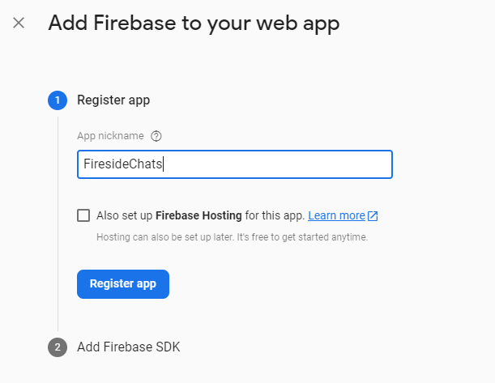

# Hacksprint Session 7: Firebase, Firestore, and Authentication

**Date**: February 24, 2021

**Location**: Zoom

**Teachers**: [Miles Wu](https://github.com/milesswu), [Alex Xia](https://github.com/khxia)

## Resources

-   <a href="https://tinyurl.com/hacksprint21-s7-slides" target="_blank">Workshop Slides</a>
-   <a href="https://members.uclaacm.com/login" target="_blank">ACM Membership Attendance Portal</a>
-   <a href="https://docs.expo.io/get-started/installation/" target="_blank">Expo Installation</a>
-   <a href="https://classic.yarnpkg.com/en/" target="_blank">Yarn Installation</a>
-   <a href="https://code.visualstudio.com/download" target="_blank">Text Editor (VS Code)</a>
-   <a href="https://firebase.google.com/docs/firestore/quickstart">Firestore Docs</a>

## Running the Demo App

Below are instructions so you can run our examples on your own time. As always, we discourage coding along during the workshop and would rather you absorb all the information properly. You can always look back at this README or run the demo project on your own later.

To run our demo app for yourself, go ahead and download the [starter.zip](./starter.zip) or [final.zip](./final.zip) file and unzip it in the directory of your choosing.

Go to the `firebase/config.js` file and **make sure you replace the empty `firebaseConfig` with your own Firebase project configuration.** You can get this from the [Firebase console](https://console.firebase.google.com/) and following the steps in [Setting up Firebase](#setting-up-firebase).

Open the project folder in VSCode and open a terminal, then run as follows.

For starter.zip (pre-firebase code):

```
# make sure you are in the root directory of the project
yarn
yarn add firebase
expo start
```

For final.zip (post-firebase code):

```
# make sure you are in the root directory of the project
yarn
expo start
```

## What we'll be learning today

-   [Quick Recap: Local Storage](#quick-recap)
-   [Databases](#databases)
    -   [What Are Databases?](#what-are-databases)
    -   [Why Do We Care?](#why-do-we-care)
-   [Firebase Firestore](#firebase-firestore)
    -   [What is Firebase?](#what-is-firebase)
    -   [What is Firestore?](#what-is-firestore)
    -   [The Firestore Data Model](#firestore-data-model)
-   [Using Firebase](#using-firebase)
    -   [Setting up a Firebase Project](#setting-up-firebase)
    -   [Integrating Firebase with React Native](#integrating-firebase-with-react-native)
-   [Using Firestore](#using-firestore)
    -   [References](#references)
    -   [Queries](#queries)
    -   [Executing Queries](#executing-queries)
    -   [Modifying Database](#modifying-the-database)
    -   [Listening for Realtime Updates!](#listening-for-realtime-updates)
-   [Fireside Chats Demo App!](#fireside-chats-demo-app)
-   [Authentication](#bonus-authentication)
    -   [Firebase Auth](#authentication-on-firebase)
    -   [Auth Demo](#auth-demo)

## Quick Recap

### Local Storage

Before we get into today's new content, let's do a quick review of last session. Specifically we'll take a look back at Local Storage in React Native.

Local Storage is a way for us to persist data in our application and also make all data available globally from a singular source. What does this mean though?

Well, persistence just means that data that is added to your application by some user should remain on the application when the user comes back later. For example, if we have a music app where users can create playlists, users who make playlists would expect that those are still accessible later on even if they close the app and come back after a week or something.

Having all data available globally from a singular source just means that any component in the app can access your data. This helps us avoid having scattered data through state and passing props everywhere. It also can prevent redundancies in data, where two copies of the same data exist in two places. For example, if a parent component has some state that is relevant for a child component, then passing those as props creates two sets of the same data in the parent and child.

Whew, okay now that we've gotten that out of the way, let's get into what Local Storage looks like in React Native.

### AsyncStorage

AsyncStorage is one of the two primary ways Local Storage is implemented in React Native. AsyncStorage works asynchronously (as the name suggests), storing data in key-value pairs. Which basically just means there is an identifier (or "key") associated with every piece of data stored. These keys are used to specify what data you want to obtain later on.

Adding to AsyncStorage

```js
import AsyncStorage from '@react-native-async-storage/async-storage';
try {
	await AsyncStorage.setItem('key', 'value');
} catch (error) {
	console.log(error);
}
```

Fetching from AsyncStorage

```js
try {
	const value = await AsyncStorage.getItem('key');
	// Do something with the value if not null
	if (value !== null) {
		console.log(value);
	}
} catch (error) {
	console.log(error);
}
```

### SecureStore

SecureStore works in the same way as AsyncStorage, except it is more ~ secure ~. This means that instead of storing your data in plaintext that anyone can understand, it will scramble/encrypt it. SecureStore is used primarily if you need to store sensitive data like passwords. It also stores its data in key-value pairs and the usage is very similar to AsyncStorage.

Adding to SecureStore

```js
import * as SecureStore from 'expo-secure-store';
try {
	await SecureStore.setItemAsync('key', 'value');
} catch (error) {
	console.log(error);
}
```

Fetching from SecureStore

```js
try {
	const value = await SecureStore.getItemAsync('key');
	// Do something with the value if not null
	if (value !== null) {
		console.log(value);
	}
} catch (error) {
	console.log(error);
}
```

## Databases

### What Are Databases?

In the simplest of terms, a database is something that stores information in an "organized" way so that it may be accessed/retreived later on. Also, we refer to the way a database stores its information as its **data model**.

This definition of databases is very broad and could be applied to many things. For the context of working with applications, let's narrow the scope of our definition/use case of databases so that we can better understand why they are useful.

Conventionally, a database acts as a central storage system for all devices that may need access to its data. Additionally, it must do so in a way that allows large volumes of data to be retreived, accessed, and modified efficiently. Usually for a database to be useful, it is made accessible through the internet. In this way, any device with an internet connection can and the correct permissions can access the database and do something with its data.

### Why Do We Care?

So great, a database can store a chonky amount of information. But why does this matter? Isn't something like Local Storage already doing something like this for us?

Well, consider an application where information is communicated across multiple devices (or users). How do we accomplish this with something like local storage? With local storage, each user's device has their own set of persisted data that is **only accessible from that specific device**. This means that we would need to come up with a way for each device using our application to share its local data with all the other devices using our app.


Just thinking about that makes my brain hurt and we could easily see how this would get complicated and inefficient. Imagine 1000 users using your app and somehow you need to get them all to communicate with the other 999 users, both sending its own data and receiving all of their data. Doesn't seem like a great way to handle it.

This is where databases come in. With a database, we can avoid the need for all devices to directly communicate with each other. Instead, all devices can communicate with a database on the internet. This centralizes and simplifies things greatly! Every device sends thier personal information to the database and recieves everyone else's information through the database, so we only ever need just one communication channel for each device.


Much simpler!

## Firebase Firestore

So now that we know what databases are, let's get into our choice of database today: Firebase's Firestore! First things first...

### What is Firebase?

Simply put, Firebase is just a collection of online services/produts that Google has developed and provided. These services are specifically targeted towards developers (that's you :0) to make the app development process easier and smoother.

Firebase hosts a incredibly wide range of products, but we will be focusing on Firestore today! You can check out what else they offer on their [website](https://firebase.google.com/).

### What is Firestore?

Like I mentioned, Firestore is Firebase's database service. We're choosing to use Firestore because of just how easy Firebase makes it to use Firestore. Often times, databases are very difficult to understand, set up, and also utilize, usually requiring extensive setup as well as the ability to host them somewhere online.

Firestore is great because it takes removes all of these limitations. Firebase is extremely easy to integrate (literally some button clicks and copy pasting a few lines of code) and using it is relatively simple too. Moreover, firebase has the advantage of being very flexible and scalable, this means that it adapts to whatever our data needs might be and also can handle large volumes of data efficiently without us having to worry about performing any optimizations.

You can learn more about Firestore on the [website](https://firebase.google.com/products/firestore) and by looking at the [docs](https://firebase.google.com/docs/firestore).

### Firestore Data Model

Firestore is a database and every database has a data model. That is, a particular way it organizes and stores its data. So before we get to work with Firestore, let's take a moment to understand its data model.

Firestore is a so-called "Document Oriented Database" (for people taking CS 143, you might be more familiar with the term "NoSQL"). What does this even mean?

Data in Firestore is stored in "documents." Each document just looks like a page of key-value pairs (very similar to JSON). Documents reside inside of collections. These collections just exist to group documents together, usually because they are related in some way.

Let's take a look at what this actually looks like in the firebase console. Below is an example of what you might see in your Firestore database:

Let's break down what this is showing us!

This database has one collection called 'chatroom' (collections can be named however you want just make sure they are unique).

This collection contains multiple message documents (documents can be named however you want just make sure they are unique).

Each message document stores our JSON-like data that consists of several "fields" (or key-value pairs).

## FiresideChats Demo App

## Using Firebase

Alright, I've already taken the liberty to build out all the UI and logic of the our cozy chat app so all we need to do is add some Firebase! 😎

### Setting Up Firebase

To set up Firebase so we can use it in our app, we have to first create a firebase project. We can do so by heading to the <a href="https://console.firebase.google.com/" target="_blank">Firebase Console!</a> After you've signed in, you'll be greeted with a screen like the one below:


After clicking on the "Add Project" button, Firebase will prompt you for a project name. You can name it anything you want, but for our demo app we'll be creating a FirebaseChats project!


It will also ask you whether you want to enable Analytics, they're cool and all but we'll turn them off for now since they require an extra step to set up.


Once Firebase is done creating a project, we need to add an app to the project. Since React Native is a cross-platform method of development, we will be choosing to add a web app. The iOS and Android options are more for native development on something like Swift or Java/Kotlin respectively.


After pressing the "Web" button, you will be primpted to register the app by giving it a nickname. Since I'm unoriginal I will name it the same thing as the project.



Once this is done, this big scary piece of code will show up. For now we don't have to worry too much about it, but do pay attention to the `firebaseConfig` object. We don't need to understand it but it will come into play later (aka copy-paste).


### Integrating Firebase with React Native

Now that we've set up our Firebase project, let's add it to our React Native project as well! To do so, we first have to install the `firebase` library. run the following command in the root directory of your React Native project:

```
yarn add firebase
```

Once, we've done this we will also create a `firebase/config.js` file in the root directory of our project. The contents of this file can be found [here](#final/firebase/config.js) and also below:

```js
import firebase from 'firebase';

let firebaseConfig = {
	// Place your own config information from the Firebase setup here
};

// Initialize Firebase
firebase.initializeApp(firebaseConfig);

// export db to access firestore
export const db = firebase.firestore();
```

And that's it! Like I said, it is super simple to integrate Firebase with our app, which is why we chose Firebase for this workshop!

## Using Firestore

Alright, now we can finally learn how to work with Firestore in our app. Let's first go over some terminology and base syntax.

### References

With Firestore, we can refer to specific collections and documents by creating what are called references. These are pretty straightforward, you can create a reference using the following code snippets:

```js
// Create a reference to the 'users' collection
db.collection('users');

// Create a referece to a specific document in the 'users' collection
db.collection('users').doc('docID');
```

### Queries

We can use references to build queries. What are queries, you might inquire? Well in the world of databases, queries are just requests to access/retreive certain information from the database. Queries allow us to specify what relevant information we want.

Simple queries consist of three "clauses":

-   where: query for all documents that meet some condition
-   orderBy: query for result documents to be ordered in some way
-   limit: only allow a certain maximum amount of result documents

The general syntax looks like this:

```js
const query = db.collection.where(...).orderBy(...).limit(...);
```

Let's take a look at some examples to make this more tangible. Consider if we have a collection of documents, where each document represents a user of our app. Each user document will contain information about that specific user.

Here's an example of a `where` query:

```js
db.collection('users').where('age', '==', 21);
```

This query is for all documents in the 'users' collection with an 'age' field having value equal to 21. We can replace 'age' with any field name, '==' with any comparison operator, and 21 with any value to create queries for all documents that meet some condition(s).

Here's an example of an `orderBy` query:

```js
db.collection('users').orderBy('name');
```

This query is to get all documents in the 'users' collection in a sorted order based on their 'name' field. We can also be more specific and specify `orderBy('name', 'asc')` or `orderBy('name', 'desc')` if we want our results to be in ascending or descending order respectively.

Here's an example of a `limit` query:

```js
db.collection('users').limit(20);
```

This query is for the first 20 documents in the 'users' collection.

We can also have "compound" queries, where we combine these clauses, for example:

```js
db.collection('users').where('age', '==', 21).orderBy('name', 'asc').limit(20);
```

This query is for the first 20 documents in the 'users' collection with 'age' equal to 21.

### Executing Queries

Great, we can build queries! But they're not all that useful on their own, in fact they don't do much. A query is really just a specification for a request. In order to actually make the request we need to execute our query with the following line:

```js
await query.get();
```

Once we've executed our query, we usually want to process the data that we get back. Let's see what that looks like all together using our example query from before:

```js
try {
	const query = db
		.collection('users')
		.where('age', '==', 21)
		.orderBy('name', 'asc')
		.limit(20);
	const querySnapshot = await query.get(); // EXECUTE QUERY
	querySnapshot.forEach((doc) => {
		console.log(doc.id, ' => ', doc.data());
	});
} catch (error) {
	console.log(error);
}
```

Whoa, whoa, whoa, let's slow down here, that's a lot of code I just threw at you so we'll break it down piece by piece.

Firstly, just notice that the real meat of this code is everything inside the `try` block. We are using the `try...catch` block here because we are good programmers and any asynchronous function call should have a `catch` in case something goes wrong. So let's just take a look at the cod ein the try block:

```js
const query = db
	.collection('users')
	.where('age', '==', 21)
	.orderBy('name', 'asc')
	.limit(20);
const querySnapshot = await query.get(); // EXECUTE QUERY
querySnapshot.forEach((doc) => {
	console.log(doc.id, ' => ', doc.data());
});
```

Starting with the first line here:

```js
const query = db
	.collection('users')
	.where('age', '==', 21)
	.orderBy('name', 'asc')
	.limit(20);
```

This is just our query from before. This query is for the first 20 documents in the 'users' collection that have 'age' equal to 21.

Next, we have the actual execution of the query:

```js
const querySnapshot = await query.get();
```

This line executes the query we built in the previous line. Since this is an asynchronous request, we use the `await` keyword to wait for the return value, which we then assign to variable `querySnapshot`. You can think of this `querySnapshot` conceptually as just a look at what the relevant documents in the database look like at the time of the query execution. Physically, the querySnapshot is an array of documents.

Next is this `forEach` call. If you're not familiar with this function it is very similar to the map function which we covered back in <a href="https://github.com/uclaacm/hack-sprint-w21/tree/master/session-2-jsx-and-basic-components#arrays" targe="_blank">session 2</a>. Essentially, what it does is go through each element in the `querySnapshot` array applying the function you passed in to each element.

```js
querySnapshot((doc) => {
	console.log(doc.id, ' => ', doc.data());
});
```

Here, each element of `querySnapshot` happens to be a document object. We can use `doc.id` to get the id of the current document and `doc.data()` to get the data stored in the current document. As a refresher, here's what those are referring to:


### Modifying The Database

Alright, retreiving information is great and all but let's get into some of the more interesting things we can do with Firestore.

### Adding Documents to Firestore Collection

There are two very simple ways we can create/add new documents to a collection in Firestore. The first is using `set()`, an example is shown below:

```js
// Add a new document in 'users' collection with id '0'
await db.collection('users').doc('0').set({
	name: 'Miles',
	age: 20,
	year: 3
});
```

Here we have a reference to a document (that doesn't exist yet) `db.collection('users').doc('0')` and we are setting the contents of this document using a JavaScript object. This document will have id '0' and will be located in the 'users' collection.

Notice also that this is an asynchronous call, so good practice would be to wrap this with a `try...catch` block. We're omitting this for simplicity and readability but be sure to include it when you're actually coding!

The other way to add a document is as follows:

```js
// Add a new document in 'users' with auto-generated ID
await db.collection('users').add({
	name: 'Miles',
	age: 20,
	year: 3
});
```

This method is very similar except we are using a reference to a collection rather than a reference to a document. Doing this will create a document with an automatically generated unique ID in the 'users' collection. The contents of which are specified by the passed in JavaScript object.

### Deleting Documents from Firestore Collection

It is not recommended to delete collections programmatically (instead you should use the firebase console) but you are able to delete documents! We can see an example of this as follows:

```js
await db.collection('users').doc('0').delete();
```

This will delete the document with ID '0' from the 'users' collection. It is worthwhile to note that based on this syntax we cannot delete a document without knowing its ID first.

### Updating Documents in Firestore Collections

If you don't want to overwrite all the content of a document, we can use the `update()` function to only overwrite the desired fields. An example below:

```js
await db.collection('users').doc('0').update({
	age: 21,
	year: 4
});
```

This will update the document with id '0' in the 'users' collection to have the following fields:

```
name: 'Miles'
age: 21
year: 4
```

Notice that 'name' remains unchanged since it was not specified in the object passed to the `update` function.

### Listening for Realtime Updates

Awesome, so now we not only know how to retrieve data from the database, but we also know how to modify the data currently in the database.

One thing is missing though... In many applications, it's very relevant to be able to get new information as it arrives (consider stock trading apps, rideshare apps, chatting apps, etc). We could try to emulate this process using a regularly scheduled query execution but there are some flaws. First, users would have to wait some arbitrary amount of time to get new information, hurting user experience. Second, this means that we will be making requests to the database even if there aren't any changes at all! This would be a waste of resources, which hurts performance and possibly your wallet too!

So how do we get around this? Well, thankfully one of the boasted features of Firestore is the ability to react to real time updates to our database. Let's see what this looks like.

```js
const query = db.collection('users').where('age', '==', 21);
const unsubscribe = query.onSnapshot((querySnapshot) => {
	querySnapshot.forEach((doc) => {
		console.log(doc.id, ' => ', doc.data());
	});
});
```

Whoa, okay let's break this down piece b piece. On the first line here, we just have a query for 'users' with 'age' equal to 21:

```js
const query = db.collection('users').where('age', '==', 21);
```

Now we start to get into unfamiliar territory, the next line has the following snippet:

```js
query.onSnapshot((querySnapshot) => {
	querySnapshot.forEach((doc) => {
		console.log(doc.id, ' => ', doc.data());
	});
});
```

This part of the code is actually what sets up the event listener (the thing that reacts to changes in the database). Whenever our query results change (meaning something in the Firestore database related to our query changed), the funciton we pass in to `onSnapshot` is going to be run. In this function, we are given a snapshot of the database which we can go through like when we used `get` to execute a query.

After this listener is set up, it will continue listening for updates to the database until we call the `unsubscribe` function it returns. Make sure to do this somewhere, otherwise your app will continue to listen for updates forever until it is closed.

## Fireside Chats Demo App

Let's get working on our demo app for this workshop. Introducing... Fireside Chats! A cozy chatting hub for you to sit back by the fire, relax, and chat with people 🥰

I've already pre-built most of the UI and logic for this app, but we're missing one thing... we can't actually talk to other people! Let's work through this together so we can integrate Firebase/Firestore and make sure our app allows communication across multiple devices!

First, go ahead and create a Firebase project using the steps in the [Setting Up Firebase](#setting-up-firebase) section. Once you'e done that, take a look in the [starter/screens/ChatScreen.js](./starter/screens/ChatScreen.js) file. Just as an overview, the UI is split up into a chat area and an input area. The chat area uses a `FlatList` to render messages on the screen (_ahem_ not ScrollView _ahem_) and the `TextInput` uses a `message` state variable to store the message the user wants to send.

Aside from this, notice that there is a `messages` state variable, which is what we'll use to store and update the messages that show up on screen. Right now, there are a couple of functions that either have a trivial implementation or no implementation at all.

Let's first go ahead and let our users send messages. Replace the current `addNewMessage` function with the following implementation:

```js
try {
	// Add new document with auto-generated ID (returns a document reference)
	const docRef = await db.collection('chatroom').add({
		uid,
		messageText,
		displayName: route.params.displayName || 'Anonymous',
		photoURL: null,
		timestamp: firebase.firestore.FieldValue.serverTimestamp()
	});
	console.log('Document written with ID: ' + docRef.id);
} catch (error) {
	console.log(error);
}
```

We can see in this implementation we're making use of the ability to create documents with auto-generated IDs. The `route.params.displayName` is the data passed from the HomeScreen (go back to session 5 if you don't remember this). The other notable thing here is the `firebase.firestore.FieldValue.serverTimestamp()` line. This is just Firebase's provided way of letting you create a timestamp object compatible with Firestore. Now we should be able to send messages and have them appear in our Firebase console.

Next, let's go ahead and let our users receive messages in real time! We can do this by replacing the `listenForUpdates` function with the following implementation:

```js
// Listen for database changes in real time
const query = db.collection('chatroom').limit(20).orderBy('timestamp', 'desc');

// query.onSnapshot creates a listerner that runs a function whenever changes occur in database
const unsubscribe = query.onSnapshot((querySnapshot) => {
	let messageArr = [];
	querySnapshot.forEach((doc) => {
		const { uid, messageText, displayName, photoURL } = doc.data();
		messageArr.push({
			messageId: doc.id,
			uid,
			messageText,
			displayName,
			photoURL
		});
		setMessages(messageArr);
	});
});

return unsubscribe;
```

Here, we can see we start off by building our desired query:

```js
const query = db.collection('chatroom').limit(20).orderBy('timestamp', 'desc');
```

Then we create an event listener using `query.onSnapshot()` which waits for updates to our query's snapshot (the result documents). This event listener takes a function which we define as

```js
(querySnapshot) => {
	let messageArr = [];
	querySnapshot.forEach((doc) => {
		const { uid, messageText, displayName, photoURL } = doc.data();
		messageArr.push({
			messageId: doc.id,
			uid,
			messageText,
			displayName,
			photoURL
		});
		setMessages(messageArr);
	}
}
```

This function takes the querySnapshot, goes through each document in the snapshot and adds the document's data to a temporary array. After all the documents have been processed, we use `setMessages(messageArr)` to update our state with the newly retreived messages.

Congrats, we now have a fully functional chat application with the bare minimum features: sending and receiving messages in real time! Woo!

## Bonus: Authentication

Ok, let's get into **authentication**. I'm sure you've heard this word being thrown around a lot. But what is it?

Authentication refers to an app's way of knowing **who** is currently using the app. If you've ever been prompted to login using Google, Facebook, Email, or Github, you're doing authentication! But why do we need authentication?

After identifying the user, an app can then do many things with that information:

-   Restrict the **data** that this user is allowed to access
-   Restrict the **actions** that this user is authorized to perform
-   Many more!

### Example

Let's take [Spotify](https://www.spotify.com/us/) as an example.


Let's say that we have two users Alex and Miles who would like to use the Spotify App. They will first be prompted to **authenticate** themselves.


Let's say that Alex uses Facebook to login, Spotify will then automatically display all of Alex's song preferences, playlists, and libraries on the homepage. This is what we mean by restricting **data**. Notice that because Miles has not logged in as the user Alex, he is not able to access the same song preferences and playlists as Alex.


Similarly, if Miles uses Google to login, Spotify will display Miles's song preferences, playlists, and libraries on the homepage. Alex is not able to access this information. Furthermore, let's say for examples sake that Miles has paid for [Spotify Premium](https://www.spotify.com/us/premium/) while Alex has not. Since Miles has signed in, Spotify will enable all the Spotify Premium features (such as no ads) that Miles has paid for, while Alex will get no such benefits. Spotify is only able to do this because it has the ability to **authenticate** its users and identify who is currently using the app. This is what we mean by restricting **actions**.

### Authentication on Firebase

Firebase has its own integrated authentication. What this means is that Firebase has coded all of the complicated authentication code for us, and all we need to do is use it!


As seen in the image above, Firebase has many different ways to allow authentication such as Google, Facebook, and Twitter. We call these **sign-in providers**. For React Native in Expo, the only sign-in providers that are in built in Firebase are **anonymous authentication** and **Email and Password authentication**.

If you want to use the other sign-in providers such as Google or Facebook, you will need to install other third-party libraries. That being said, the methodology and workflow for all of these sign-in providers is quite similar. For this reason, for this workshop, we will be covering anonoymous authentication.

The important methods that we will be using will be:

```js
const auth = firebase.auth();
```

This is our `firebase` authentication object. This will be the interface through which we will call our authentication functions. Refer to the [firebase.auth documentation](https://firebase.google.com/docs/reference/js/firebase.auth.Auth#getRedirectResult) to see the methods that you can use. You will see the `auth.signInAnonymously()` and `auth.signInWithEmailAndPassword()` that we talked about previously.

```js
auth.onAuthStateChanged((user) => {
	/* Our user has signed in or signed out */
	/* So do something here */
});
```

This is a listener that we can add to our app to listen for any changes in the **authentication state**. What this means is that whenever a user signs in or signs out, it will call the function specified in the argument, the app can do whatever it needs to do inside this function. We will see why this listener is useful later.

```js
// Signs in the user with a randomly generated User ID
// This is accessible through the user.uid in the onAuthStateChanged() callback
await auth.signInAnonymously();

// Signs out the current user
await auth.signOut();
```

These two functions are the two methods that we will actually use to login and logout the user. Remember that this function returns a **promise**, so we need to use the `await` keyword! And if you're wondering, the promise doesn’t **resolve** into anything, so we don’t need to create a `return` value.

So now that we've learnt about these useful Firebase methods, we can apply them to our demo!

## Auth Demo

By default, Firebase disables all forms of authentication on your project. So first things first, we need to enable sign-in provider that we will be using, in this case, it will be **anonymous authentication**.


Now, we can do some setup. In our `./firebase/config.js` file, we want to create our `auth` object and export it so that the rest of the project will be able to access it.

```js
// firebase/config.js
export const auth = firebase.auth();
export const db = firebase.firestore();
```

This way we will be able to access the `auth` object by importing it like so:

```js
import { auth } from '../firebase/config';
```

Now we can go on to actually code our authentication logic.

Remember that in our app, we had a `HomeScreen` screen that would prompt the user to login. But currrently, it does nothing! So let's fix that.

In our `HandleLogin` function, we want to login our user. What better function to use than the `auth.signInAnonymously()` function?

```js
// HomeScreen.js
const handleLogin = async () => {
  try {
      await auth.signInAnonymously();
  } catch (e) {
      console.log(e);

  /* Pre-Auth
  navigation.navigate('Fireside Chats');
  */
}
```

But wait, how will the rest of our app know that our user has logged in? We will now use the `onAuthStateChanged` listener that we talked about before.

```js
// HomeScreen.js
useEffect(() => {
  auth.onAuthStateChanged(async (user => {
    if (user) {
      const uid = user.uid;
      try {
        await AsyncStorage.setItem('user', uid);
        await AsyncStorage.setItem('displayName', 'Anonymous');
      } catch (e) {
        console.log(e);
      }
      navigation.navigate('Fireside Chats');
    }
    })
}, [])
```

Ok so let's break down what I did. First of all, I wrapped everything in a `useEffect` that only runs once when the component is rendered. Why? Because we only need one instance of the listener to exist.

Next, inside our callback, we can access the new randomly generated uid of our anonymous user with `user.uid`. We then store this uid in our `AsyncStorage` so that the rest of the app can use it. Similarly, we also store a `displayName` key into our `AsyncStorage` with default value `'Anonymous'`.

We also wrapped every thing an `if-statement` to check if the user actually undefined. If it is, it means that we have successfully logged in. Otherwise, we the login either failed, or the user has logged out.

So lets handle our logout functionality. For our `HandleLogout` function, we need to make sure to log our users out properly using the `auth.signOut` function.

```js
// HomeScreen.js
const handleLogout = async () => {
	try {
		await auth.signOut();
		await AsyncStorage.setItem('user', '');
		await AsyncStorage.setIt('displayName', '');
	} catch (e) {
		console.log(e);
	}
};
```

This should look familiar. All we are doing is signing the user out, then updating the `AsyncStorage` values to empty strings so that the app knows that there is no user currently signed in.

### Updating the rest of the app

Ok! So we are actually done with all of the authentication stuff. All that's left now is to integrate the user IDs and display names that we have saved onto our `AsyncStorage` in the rest of the app.

The rest of this demo will be pretty fast since there will be no material covered. If you find any part confusing, then I highly recommend that you refresh yourself on the concepts that we convered in previous workshops.

Without further delay, let's get started. In our `ChatScreen` screen, we call the function `getCurrentUser` whenever the app is first run. All it did was update a `currentUser` state variable to 0. Instead of 0, we want it to be the proper user ID that we saved into `AsyncStorage`. So our function should look something like this:

```js
// ChatScreen.js
const getCurrentUser = async () => {
    // Post-Firebase TODO: get current user ifrom local storage
    try {
        const id = await AsyncStorage.getItem('user');
        if (id !== null && id !== '') {
            setCurrentUser(id);
        }
    } catch (e) {
        console.log(e);

    /* Pre-Authentication implementation
        setCurrentUser(0);
    */
}
```

Great. Now, the entire ChatScreen component will be using the correct user ID. There is still one more place we have to change. Whenever we add a new message onto the database, we are using the a hardcoded display name. Instead, we should be using the display name that we have stored on the `AsyncStorage`.

Hence, we should modify our `addNewMessage` function to:

```js
// ChatScreen.js
const addNewMessage = async (uid, messageText) => {
	try {
		const name = await AsyncStorage.getItem('displayName');
		const docRef = await db.collection('chatroom').add({
			uid,
			messageText,
			displayName: name || 'Anonymous',
			photoURL: null,
			timestamp: firebase.firestore.FieldValue.serverTimestamp()
		});
		console.log('Document written with ID: ' + docRef.id);
	} catch (error) {
		console.log(error);
	}
};
```

Great! Now our app works as intended! We are able to:

-   Login as an anonymous user with a unique user ID
-   Send messages to the database with our unique ID and the display name "Anonymous"

Go check it out!

### Changing our display name

This section is a bit of an extra section because [Miles Wu](https://github.com/milesswu) is crazy. We will go over an example of how we can update the database using firebase and authentication.

Currently, all of our user's display name is "Anonymous", which is a bit boring. We want our users to be able to change their display name to whatever they want, which will update the Cloud Firestore as well as the `AsyncStorage`.

First things first is to create another screen called `ProfileScreen` and add it to the `Tab Navigator`. With a bit of styling, our app looks a bit like this:


Now comes to coding the logic of this component. There are two functions to implement.

First, is when we first load the component, we want to be able to get the current display name. As seen in the image above, the users current display name is automatically displayed inside the `TextInput`.

This can be easily achieved with the things that we have learned so far with state and `AsyncStorage`.

```js
// ProfileScreen.js
const [name, setName] = useState('');

const getDisplayName = async () => {
	try {
		const displayName = await AsyncStorage.getItem('displayName');
		setName(displayName);
	} catch (e) {
		console.log(e);
	}
};

useEffect(() => {
	getDisplayName();
}, []);
```

As seen, the only noteworthy thing we did was to get the current `displayName` from our local storage and set it to our current state variable so that we can keep track of it.

The second function that we need to be able to implement is the meat of the component. Once our user clicks the **save** button after inputting a new display name, we want our app to:

-   Change our local display name to the new display name
    -   This is so that every subsequent message that we add to the database will contain our new display name
-   Update all previous messages in the database that this user sent to contain the new display name instead of the old display name.
    -   This is to ensure that other users will see the consistency of the name change from old messages to any new messages.

Our function should then look something like this:

```js
// ProfileScreen.js
const updateDisplayName = async (name) => {
	try {
		const id = await AsyncStorage.getItem('user');
		const query = db.collection('chatroom').where('uid', '==', id);
		const querySnapshot = await query.get();
		querySnapshot.forEach(async (doc) => {
			try {
				await db.collection('chatroom').doc(doc.id).update({
					displayName: name
				});
			} catch (error) {
				console.log(error);
			}
		});
		await AsyncStorage.setItem('displayName', name);
	} catch (error) {
		console.log(error);
	}
};
```

Let's break it down. First, we will get our current user ID from local storage. Then, we query all of the messages in our collection that have been sent by our current user ID. We save this array of messages in the `querySnapshot` variable.

Then, we will loop over every single message in the `querySnapshot`, and call `db.collection().doc().update()` to update the `displayName` of every message to the new display name.

Finally, we will do `AsyncStorage.setItem()` to change the local display name to the new display name.

We are now done! Once, we save our new display name, it will automatically update the database as well as the local storage. Our Fireside Chats app is now functionally as it is supposed to.

If you are still confused about the structure of the whole demo, you can refer to the final code in this repository.
